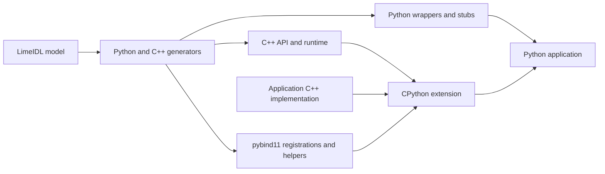

# Developing Python bindings

The maintained entry points are the [user guide](../../python_bindings.md) and
[architecture decisions](python_bindings_architecture_decisions.md). The runnable
[Calculator example](../../../examples/calculator/python/README.md) covers generation,
native implementation, configuration and public Python usage.

The wrapper language minimum is Python 3.10; the declared pybind11 minimum is
3.1.0. The Calculator example has been validated with Python 3.14 and pybind11
3.1.0 on Linux using Java 17. This does not establish a platform or interpreter
matrix, free-threaded/subinterpreter support, or a complete wheel-distribution contract.

## Pipeline and source map

| Responsibility | Maintained source |
| --- | --- |
| Filtered models, import/constructor/hash metadata and output planning | [PythonGenerator.kt](../../../gluecodium/src/main/java/com/here/gluecodium/generator/python/PythonGenerator.kt) |
| Python and native names/types | [Python generator package](../../../gluecodium/src/main/java/com/here/gluecodium/generator/python/) |
| Wrapper conversion, callback bridges, snapshots and weak identity cache | [PythonNativeBase.mustache](../../../gluecodium/src/main/resources/templates/python/PythonNativeBase.mustache) |
| Native function/callable conversions and GIL scopes | [Python templates](../../../gluecodium/src/main/resources/templates/python/) (`Pybind11Function`, `Pybind11GenericCaster`, trampoline and property templates) |
| CMake extension target and Python discovery | [Python.cmake](../../../cmake/modules/gluecodium/Python.cmake) |

Change metadata in the generator and structure in the templates. Inspect both
runtime and stub output: a syntactically valid stub can still misdescribe public
constructors or inheritance. Internal pybind11 transport types are not the public
Python API, especially for equatable structs and callback values.

## Verification

Build and run the [Calculator example](../../../examples/calculator/python/README.md)
with the interpreter selected for the extension build. Inspect both runtime and
stub output when changing a boundary. Generated files must be regenerated after
template changes, and a new native build directory is needed after an interpreter
or ABI change.

Automated Python smoke comparisons, functional regressions and CI are supplied by
the stacked verification change. The implementation and Calculator example can be
built independently of that test infrastructure.
