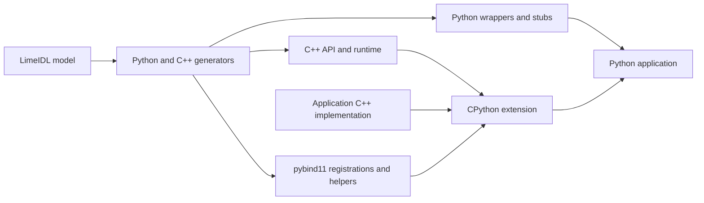

# Developing Python bindings

The maintained entry points are the [user guide](../../python_bindings.md),
[architecture decisions](python_bindings_architecture_decisions.md),
[functional-test guide](python_functional_tests.md), and
[CI guide](python_ci.md). The runnable
[Calculator example](../../../examples/python/README.md) covers generation, native
implementation, configuration and public Python usage.

The wrapper language minimum is Python 3.10; the declared pybind11 minimum is
3.1.0. CI currently validates Python 3.14 with pybind11 exactly 3.1.0 on Linux,
using Java 17. That job does not establish a platform or interpreter matrix,
free-threaded/subinterpreter support, or a complete wheel-distribution contract.

## Pipeline and source map

| Responsibility | Maintained source |
| --- | --- |
| Filtered models, import/constructor/hash metadata and output planning | [PythonGenerator.kt](../../../gluecodium/src/main/java/com/here/gluecodium/generator/python/PythonGenerator.kt) |
| Python and native names/types | [Python generator package](../../../gluecodium/src/main/java/com/here/gluecodium/generator/python/) |
| Wrapper conversion, callback bridges, snapshots and weak identity cache | [PythonNativeBase.mustache](../../../gluecodium/src/main/resources/templates/python/PythonNativeBase.mustache) |
| Native function/callable conversions and GIL scopes | [Python templates](../../../gluecodium/src/main/resources/templates/python/) (`Pybind11Function`, `Pybind11GenericCaster`, trampoline and property templates) |
| CMake extension target and Python discovery | [Python.cmake](../../../cmake/modules/gluecodium/Python.cmake) |
| Enabled functional features and native sources | [functional CMake configuration](../../../functional-tests/functional/CMakeLists.txt) |
| Public API, typing, worker and lifetime regressions | [Python functional tests](../../../functional-tests/functional/python/test/) |
| Generator output comparisons | [smoke fixtures and references](../../../gluecodium/src/test/resources/smoke/) |

Change metadata in the generator and structure in the templates. Inspect both
runtime and stub output: a syntactically valid stub can still misdescribe public
constructors or inheritance. Internal pybind11 transport types are not the public
Python API, especially for equatable structs and callback values.

## Verification when changing a boundary

1. Add a regression that fails with the previous generated output. Exercise the
   public API through C++ rather than only calling a Python override directly.
2. Build the generator and compare refreshed smoke references. Review output
   differences, including unrelated fixtures affected by common runtime helpers.
3. Regenerate functional bindings, reconfigure when generated source lists change,
   and rebuild the extension with the selected interpreter. Verify output content
   so a cached generation step cannot silently test old templates.
4. Run CTest/pytest and focused positive/negative mypy consumers for stub changes.
   Use bounded subprocess cases for deadlocks, worker shutdown and ownership.

Follow the commands in the [CI guide](python_ci.md); use a fresh native
build directory when the interpreter/ABI changes. The shell interpreter probe
currently accepts versions older than the wrapper minimum and checks pybind11
presence rather than its minimum version. Select a suitable interpreter explicitly
and install the CI requirements; CMake's stricter Python check remains authoritative.

## Troubleshooting and history

See [native debugging](debugging_native_crashes.md) for debugger setup and boundary
checks. Historical reviews, fix reports, phase plans, ad hoc fixtures, macOS-only
spikes and the older Greeter sample
are available in Git history. Their useful rationale is captured in the architecture
records; the maintained Calculator example and real functional suite replace those
prototypes as executable verification.
