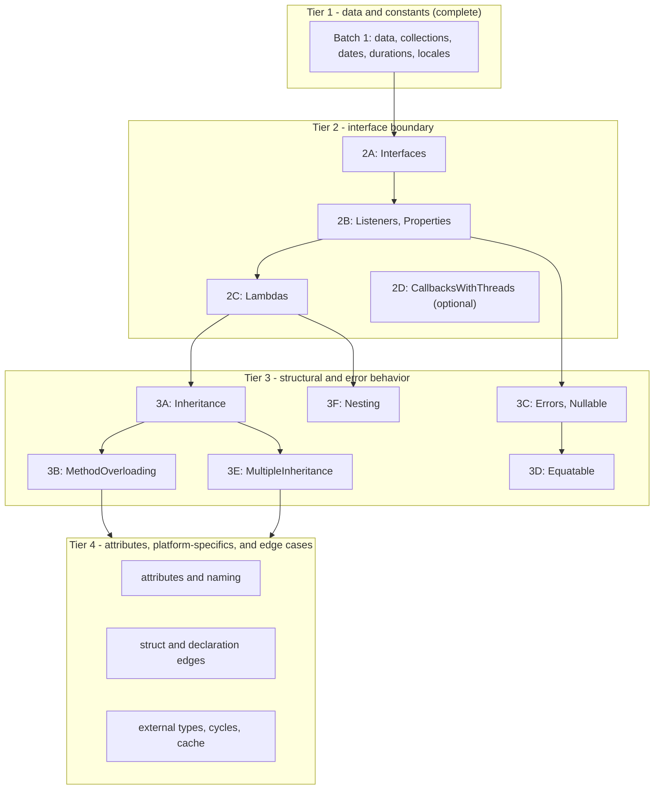

# JavaScript/Embind Generator - Phase 8 Status

**Status**: Batch 6B circular-dependency coverage complete; Batch 6A external-type coverage
complete; Batch 5B constructor and struct-shape coverage complete; Batch 5A declaration-order
and companion-surface coverage complete; Batch 4B
documentation and public naming coverage complete; Batch 4C package identity and collision
coverage remains complete; native lambda-return support remains deferred; the complete JavaScript
functional gate passes

**Date**: 2026-08-25

## Checkpoint Scope

The first Phase 8 checkpoint adds a Node.js functional-test harness modeled on the Python
functional tests in the parallel `gluecodium1` checkout. It now enables three feature groups for
the `js` generator:

- `Strings`: string parameters and returns, C-string conversion, overloaded static methods, and
  read-only static properties;
- `BuiltinTypes`: Boolean, Float, Double, signed and unsigned integer mappings, including 64-bit
  values as JavaScript `bigint`.
- `Enums`: enum member export and round-trip behavior, including enums used by type collections.
- `Constants`: scalar, enum, special numeric, class, struct, collection, and skipped constant
  behavior.
- `Structs`: public and nested value-object fields, object-literal input, field mutation, and
  accessor-backed C++ struct fields.
- `Blobs`: `std::shared_ptr<std::vector<uint8_t>>` conversion to and from JavaScript `Uint8Array`,
  including blobs nested in value objects, byte-buffer APIs, and nullable results.
- `Classes`: static factory construction, instance method mutation, shared-pointer round trips,
  referential aliasing, and explicit `delete()` disposal.
- `TypeDefs`: primitive, nested, blob, type-collection, and struct aliases through static class
  methods.
- `Defaults`: primitive, special numeric, empty collection, initializer collection, external enum,
  and struct defaults.
- `GenericTypes`: nested arrays, maps, sets, maps of arrays, and collection values involving
  structs.
- `Dates`: epoch-millisecond conversion for `Date`, nullable Date values, Date sets, and adapted
  static properties.
- `Durations`: native duration counts map to JavaScript `bigint` values, preserving parameter-level
  C++ type overrides.
- `Locales`: BCP-47 strings, nullable values, adapted static properties, Locale fields in value
  objects, defaults, and Locale list/set/map collections.
- `Visibility` and `SkipAttribute`: internal declarations, member-level visibility, generic skip
  tags, enabled and disabled conditional tags, and platform-specific skip isolation.

The harness uses Node's built-in `node:test` runner and CTest. CMake copies the test modules into
the build tree and passes the generated Emscripten module through `GLUECODIUM_JS_MODULE`.

Batch 2B adds JavaScript coverage for interface listener and property trampolines:

- `Listeners`: JavaScript implementations receive native callbacks and interface properties
  dispatch through generated wrappers;
- `ComplexListeners`: callbacks convert structs, collection aliases, enums, and blobs;
- `ListenersWithReturnValues`: callbacks return strings, structs, classes, enums, arrays, maps,
  and blobs through the native interface;
- `Properties`: readable and writable interface properties are exercised through JavaScript
  implementations.

Batch 2C adds the first lambda conversion slice:

- JavaScript functions passed to native lambda parameters are retained through `emscripten::val`
  captures and invoked with the generated C++ lambda signature;
- nullable lambda parameters, lambdas nested in collection parameters, overloaded lambda
  parameters, and lambda types declared inside structs are covered;
- native lambda returns and lambda-valued fields remain deferred because Emscripten embind does not
  register arbitrary `std::function` values as JavaScript-callable values. They require a separate
  callable-wrapper design and are not represented as passing Batch 2C coverage.

#### Batch 3A - single inheritance (complete)

JavaScript coverage now enables the existing `Inheritance` fixture and verifies:

- overridden methods dispatched through inherited interfaces;
- primary-base class inheritance across multiple levels, including inherited methods and
  properties on `ConcreteGrandChild`;
- derived instances returned through an inherited interface type.

The fixture dependency closure uses a small JS-only provider fixture for `ConstructorOverloads`
and `ThrowingConstructor.Some`, which are referenced by `ChildConstructorOverloads` in
`Inheritance.lime`. The broader `MethodOverloading` and `Errors` bundles remain disabled for JS
because they include later-batch overload and interface-error fixtures. No separate JS test is
added for those dependency types in this batch. The JS generator already emits embind `base<>`
registration and inherited interface trampolines, so this batch required functional integration
and runtime coverage rather than a generator-template change.

#### Batch 3B - inherited method overloads (complete)

The existing `MethodOverloading` feature remains unchanged and continues to target the non-JS
generators. To preserve its LimeIDL inputs, JavaScript uses the isolated
`MethodOverloadingJavaScript` feature with the existing `InheritanceOverloads.lime` model, a new
helper Lime file containing only the native factory declaration, and a small C++ implementation
that returns a concrete derived class. The focused Node test covers overloads inherited by a
JavaScript interface implementation and overloads inherited by a native class, including
same-arity `int` versus `string` dispatch.

The JS generator now gives overloaded instance methods private Embind registration names and emits
type-based prototype dispatchers in the package facade. Primary inherited methods are included in
derived registrations, and the wrapper runtime preserves overload metadata when it wraps methods.
The non-static Embind templates use the generated runtime names, allowing the facade dispatcher to
call inherited parent overloads on derived instances. Existing
`InheritanceJavaScriptDependencies.lime`, `InheritanceOverloads.lime`, and `MethodOverloads.lime`
files remain unchanged.

#### Batch 3E - multiple inheritance (complete)

Feature: `MultipleInheritance`.

The JavaScript functional build now enables the existing multiple-inheritance fixture and registers
`multiple-inheritance.test.mjs`. The focused tests cover:

- `MultiClass` with `OpenClass` as the primary Embind `base<>` and `NarrowInterface` members
  flattened onto the derived binding;
- `MultiInterface` with `RegularInterface` as the primary Embind `base<>` and
  `NarrowInterface` methods and properties flattened onto the derived binding;
- native dynamic-cast detection, direct secondary-interface views, and shared-pointer identity
  through a supported narrow-interface round trip.

Embind supports only one registered `base<>` in this generator. Secondary parents are therefore
represented by direct derived-type member registrations, not by a second Embind base conversion.
The fixture's helper that returns a `NarrowInterface` from a `MultiInterface` cannot be called from
JavaScript because Embind has no registered smart-pointer conversion for that secondary-base cast;
that unsupported pointer conversion is deliberately outside this batch's contract.

## Verification

With Emscripten 6.0.8 and Node.js available:

```bash
rm -rf build-functional-js
export GLUECODIUM_PATH="$PWD"
emcmake cmake -S functional-tests -B build-functional-js -G Ninja \
  -DGLUECODIUM_GENERATORS_DEFAULT='cpp;js' \
  -DFUNCTIONAL_BUILD_JS_TESTS=ON
cmake --build build-functional-js --target functional_bindings_js
ctest --test-dir build-functional-js --output-on-failure -R unit_tests_javascript
```

The generated module is compiled with `-sWASM_BIGINT=1`, and the Node tests assert `bigint` values
for `Long` and `ULong` methods. The focused Structs test passes all three cases. The focused
Classes test passes both cases, including instance mutation, shared-pointer round trips, and
referential aliasing. The Batch 3A `inheritance.test.mjs` module passes all three cases after a
clean reconfigure, generation, and Emscripten build. The clean-build `lambdas.test.mjs` module
passes all four cases, including collection and nullable lambda paths.
The focused Blobs test passes all four cases, including null shared pointers mapping to an empty
`Uint8Array` for non-nullable results and `undefined` for nullable results. Immutable structs and
structs containing immutable fields use generated `emscripten::val` adapters instead of embind
`value_object` registration. The adapters construct C++ structs from plain JavaScript objects and
convert returned structs back recursively, including nested structs, blobs, nullable fields, and
collection values. The `Blobs`, `Defaults`, and `PlainDataStructuresImmutable` fixtures are
covered by the JavaScript functional tests.
The Dates test passes for pre-epoch, epoch, and post-epoch values, nullable values, Date sets, and
static Date properties. Native Date values are converted through epoch milliseconds, with explicit
JavaScript numeric construction to avoid Emscripten `long long`/`bigint` coercion failures.
The Durations test passes for seconds and milliseconds, including sub-second millisecond values,
nullable results, duration value objects, and JavaScript `bigint` overload dispatch. Native duration
counts are exposed directly as `bigint`; generated embind helpers preserve the native duration type
when converting inputs, including parameter-level C++ type overrides.
The Locale-only test passes all four cases. The class tests load the generated public package
index, which maps the internal embind class names to the public JavaScript exports. The CMake
functional-test registration is limited to the feature groups and test modules currently covered
by the JavaScript generator.
Locale maps to JavaScript `string`; generated
adapters use the shared `gluecodium_locale_to_native` and `gluecodium_locale_to_js` helpers for
methods, properties, value-object fields, defaults, and collections.
The Batch 2B listener and property tests also pass in the clean Emscripten build. Callback
trampolines use JavaScript-value adapters for collection and struct aliases, recursively convert
callback arguments and return values, and expose native blobs as `Uint8Array` values.
The Batch 2C lambda tests pass in a fresh Emscripten 6.0.8 build. Direct, nullable, collection,
overloaded, and struct-defined JavaScript callbacks all use the same generated `emscripten::val`
adapter path. Native-created lambda returns still fail as unbound `std::function` values and are
explicitly deferred to the next lambda capability slice.
The Batch 3D `equatable.test.mjs` module passes all four cases, covering nested value equality,
nullable and immutable fields, same-hash behavior for equal values, equatable pointer fields, and
referential equality for equatable classes and interfaces. The JS overload dispatcher now uses
public struct field names to distinguish same-arity plain-object overloads.
The focused `method-overloading.test.mjs` module passes both inherited-interface and
inherited-class cases. The complete `unit_tests_javascript` CTest target passes with all registered
JavaScript functional tests. The focused `multiple-inheritance.test.mjs` module passes all three
cases after a clean local-generator rebuild, including flattened secondary methods and properties
on both classes and interfaces. The full `unit_tests_javascript` CTest target passes with all 52
registered tests.
The focused `nesting.test.mjs` module passes all five cases, including nested declaration exports,
flattened-name collision handling, nested interface dispatch, adapted read-only properties, and
nested struct error wrapping. The full `unit_tests_javascript` CTest target passes all 61
registered tests after a clean Emscripten 6.0.8 rebuild. Batch 4A adds
`visibility-skip.test.mjs`, and the refreshed `unit_tests_javascript` CTest target passes all 64
registered tests with the `Visibility` and `SkipAttribute` fixtures enabled for JS. Batch 4B adds
`naming-and-docs.test.mjs`; its focused module passes all 3 cases after a clean local-generator
Emscripten 6.0.8 rebuild, and the refreshed JavaScript gate passes all 69 registered tests.
Batch 6A adds `external-types.test.mjs`; its focused module passes all 3 cases after a clean
local-generator Emscripten 6.0.8 rebuild. External value objects, enums, accessor-backed
collections, and cross-package extraction are covered through the existing `ExternalTypes`
fixture and its separately supplied native headers and implementations.
Batch 6B adds `circular-dependencies.test.mjs`; its focused module passes the compile/load smoke
case after a clean local-generator Emscripten 6.0.8 configure and build. The mutually dependent
`Alice` and `Bob` declarations generate, link, initialize, and remain available through the public
package facade with both method surfaces and disposal members. The fixture has no native factories,
so runtime method invocation is outside this slice.

## Generator Fixes Exercised

The first tests found several embind generation defects that are fixed in this checkpoint:

- read-only instance properties emit getter-only `.property` registrations, while read-only
  static properties use a named getter function because embind has no function-based
  `.class_property` overload;
- overloaded functions use the typed adapter path so their C++ overload is resolved at generation
  output compile time.
- generated struct field pointers use C++ name resolution, preserving native names such as
  `set_field` when the JavaScript name is `setField`;
- accessor-backed structs use typed non-capturing getter/setter function pointers for embind
  `value_object` fields, preserving C++ reference signatures for nontrivial values;
- generic vector/map/optional registrations include the C++ headers needed by their element types;
- enum bindings avoid Emscripten runtime names such as `InternalError` by using a distinct embind
  public name while retaining the generated C++ type identity.
- Blob adapters convert JavaScript typed arrays with `convertJSArrayToNumberVector` and convert
  native byte vectors back with `emscripten::val::array`, guarding nullable shared pointers.
- package facades attach generated scalar, enum, and struct constants to their owning runtime
  exports, preserve nested-name compatibility, and use an empty-object fallback for value objects
  whose embind constructor is unavailable.
- collection-bearing struct fields use explicit `emscripten::val` adapters, allowing native
  `std::vector`, `std::unordered_map`, and `std::unordered_set` fields to cross the JS boundary
  without relying on unsupported unordered-container embind registrations.
- Date adapters convert `std::chrono::system_clock::time_point` through epoch milliseconds, map
  nullable results to the existing JS `undefined` convention, and expose adapted static properties
  through hidden embind accessors plus runtime `Object.defineProperty` descriptors.
- Duration adapters convert native `std::chrono::duration` counts to JavaScript `bigint` values and
  back through shared embind helpers, preserving seconds and milliseconds overrides. Same-arity
  static overloads use private embind registration names and a generated JavaScript type dispatcher;
  methods with distinct JavaScript names retain their public embind registrations.
- Inherited and same-arity instance overloads use private Embind registration names plus generated
  prototype type dispatchers. Derived bindings explicitly register primary inherited overloads so
  parent methods remain callable through derived instances.
- Multiple-inheritance bindings select one primary Embind `base<>`, flatten secondary-parent
  methods and properties onto the derived registration, and use raw-pointer lambda adapters for
  flattened interface methods. JavaScript declarations include inherited functions and properties.
- Nested package exports preserve the established flattened names for duplicate nested leaves and
  fall back to a unique embind runtime name when flattened names collide. Nested adapted read-only
  class and interface properties emit getter-only registrations. Thrown static struct functions
  wrap their module-level embind registrations, and generated interface declarations keep disposal
  members inside the interface body.
- nested C++ type references in collection converters and external enum values use fully qualified
  C++ names; local CMake builds propagate owner-target include directories to the JS module target.
- Locale adapters convert BCP-47 strings through the generated native `Locale` type, preserving
  language, script, and country components when returning a language tag.
- Interface wrappers canonicalize initialized embind handles passed as arguments. The wrapper
  runtime uses a pointer-based alias fallback when Emscripten's `isAliasOf` cannot compare
  interface handles with non-writable internal `$$` properties, and preserves shared `__Wrapper`
  handles instead of eagerly deleting them during canonicalization.
- Interface callback trampolines adapt collection and struct aliases through `emscripten::val`,
  recursively convert callback arguments and return values, preserve `@Cpp(Const)` methods, and
  construct callback blobs as JavaScript `Uint8Array` instances.
- Threaded interface and lambda callbacks dispatch synchronously to the main Emscripten runtime
  thread. Runtime-thread-owned value holders defer `emscripten::val` destruction, and interface
  adapters preserve embind smart-pointer identity so JavaScript subclass prototypes survive native
  round trips. Runtime-thread teardown calls `__destruct` to unregister inherited instances.
- Lambda parameters use the recursive JavaScript-to-native conversion path, including nullable
  lambdas and lambdas nested inside collections; native lambda returns remain outside this slice
  until a callable embind wrapper is designed.
- Static properties use named getter and setter functions for Emscripten compatibility, and
  adapted static constructors and methods use function-pointer lambdas to resolve Embind
  overloads reliably.
- JavaScript model filtering keeps internal declarations in the embind model when they are needed
  by native signatures, while removing them from public package and TypeScript stub generation.
  Generic `@Skip` and `@EnableIf` tags are applied independently of platform-specific attributes,
  so `@Java`, `@Swift`, `@Dart`, and `@Kotlin` visibility annotations do not accidentally change
  the JavaScript surface.
- Package-local JavaScript exports retain directory-based package paths, including underscore
  package components, while embind registrations use canonical full-path runtime names to avoid
  cross-package leaf-name collisions.
- External-owned methods use typed adapter lambdas so native overloads that are not represented in
  LimeIDL cannot make embind member-pointer registration ambiguous. External interface properties
  use adapter getters, including a narrowly scoped const-cast for legacy non-const native getters;
  generated wrappers do not mark their destructor `override` when an external base destructor is
  non-virtual.
- External accessor-backed collection fields use the JavaScript `emscripten::val` collection
  conversion path. External getters that return values emit value-returning field adapters, which
  avoids dangling references from temporary strings, vectors, and nested external structs.
- TypeScript declaration imports are resolved relative to the declaring package directory, keeping
  same-package references local and correctly traversing between nested package directories.

## Lessons Learned

- Treat LimeIDL inputs as a dependency-closed set for each feature. `StaticTypedef.lime` references
  `TypeCollection.PointTypedef`, so the TypeDefs feature must include `TypeCollection.lime` or model
  validation and generation will fail before the JS bindings are produced.
- CMake generation runs the Gradle wrapper project under `cmake/modules/gluecodium/gluecodium/details`,
  which normally resolves the published Gluecodium artifact. Set `GLUECODIUM_PATH="$PWD"` when
  validating local generator changes; running the repository root's `./gradlew run` is not an
  equivalent replacement and can hide or create misleading ServiceLoader/provider failures.
- Direct Gluecodium generation updates `main/js`, but the package copied beside the Emscripten module
  is produced by the JS target's `POST_BUILD` step. Rebuild the module after generation, and use the
  same local-generator setting, or Node tests may import stale package indexes.
- CMake copies Node test modules into the build tree during configuration and constructs the CTest
  command from the configured file list. After adding or changing test registration, rerun the CMake
  configure step, or use a clean build directory, before running CTest; a compile-only rerun can
  execute an older copied test set.
- The generated binding rule does not track Mustache template changes as Ninja dependencies. When a
  runtime template changes, rebuild with `--clean-first` (or remove the build directory) before
  interpreting test results, otherwise the Emscripten module may still contain stale generated code.
- A type alias does not create an embind runtime object. The package facade must export the owning
  class or struct that contains alias-using methods; TypeScript alias declarations alone do not make
  a runtime `StaticTypedef` export appear.
- Register every new Node test in both parts of `functional-tests/functional/js/CMakeLists.txt`:
  `configure_file` copies the test into the build tree, while the `add_test` file list is what executes
  it.
- Batch 4A keeps the embind and public-stub filters separate: filtering internal declarations out
  of embind would break visible signatures that refer to internal types, while leaving them in the
  public model leaks declarations through package indexes.
- Embind's single `base<>` registration does not provide smart-pointer conversions through a
  secondary C++ base. Multiple-inheritance coverage must distinguish flattened member dispatch
  and native cast checks from unsupported secondary-base pointer returns.

## Batch 1 Result

Batch 1 implementation is complete for the JavaScript generator. Locale and class behavior are
verified with focused test commands, and the broader registered suite passes in a clean build. The
Node.js harness passes explicit test-file paths
because the Node versions tested locally (22.13.1, 22.19.0, 23.6.1, 24.16.0, and 25.7.0) treat a
directory argument to `node --test` as a module entry rather than a test collection.

## Next Work

The next iteration starts with the deferred runtime-contract slices documented below. The Node versions
tested locally (22.13.1, 22.19.0, 23.6.1, 24.16.0, and 25.7.0) all
treat a directory argument to `node --test` as a module entry rather than a test collection, so
the harness passes explicit test-file paths.

The original feature groups are not all dependency-isolated. The `Inheritance` CMake feature
also includes listener-inheritance and interface-lambda fixtures, and `MethodOverloading`
includes `InheritanceOverloads.lime`. The revised plan therefore uses capability slices and
explicit preflight checks instead of assuming that a feature name is a single capability. If a
feature bundle cannot be enabled without pulling in a later capability, split the fixture or add a
focused test at the earlier capability gate before enabling the bundle.

## Feature Enablement Plan

This is the working plan for enabling the remaining functional-test coverage for the `js`
generator. Each capability slice builds only on behavior proven by an earlier slice. A slice ends
with the relevant `feature(...)` line gaining `js`, a new focused
`js/tests/<feature>.test.mjs` file registered in `functional-tests/functional/js/CMakeLists.txt`,
and a green `ctest -R unit_tests_javascript` run. A slice may be split further when a legacy CMake
feature bundles fixtures from a later slice.

### Current state (already enabled and passing)

| Feature | Notes |
|---------|-------|
| Strings | string params/returns, C-string conversion, overloads, static properties |
| BuiltinTypes | Boolean/Float/Double/int mappings; 64-bit as `bigint` |
| Enums | member export, round-trip, type-collection enums |
| Structs | value objects, nested structs, object-literal input, accessors |
| Blobs | `shared_ptr<vector<uint8_t>>` <-> `Uint8Array`, nullable results |
| Classes | factories, instance methods, shared-pointer aliasing, explicit `delete()` |
| Constants | scalar, enum, struct, collection, and skipped constant exports |
| TypeDefs | primitive, nested, blob, type-collection, and struct aliases |
| Defaults | primitive, special numeric, collection, external enum, and struct defaults |
| GenericTypes | nested arrays, maps, sets, and collection values involving structs |
| Dates | epoch-millisecond conversion, nullable values, sets, static properties |
| Durations | duration counts and value objects exposed as JavaScript `bigint` |
| Locales | BCP-47 strings, nullable values, fields, defaults, and collections |
| Interfaces | JS-created implementations, native dispatch, nested interface round trips, and properties |
| Listeners | JS listener implementations and native callback dispatch |
| ComplexListeners | struct, collection alias, enum, and blob callback arguments |
| ListenersWithReturnValues | scalar, struct, class, enum, collection, and blob callback returns |
| Properties | interface getter and setter dispatch through JS implementations |

### Dependency analysis

The remaining work is best treated as four capability tiers with smaller gates inside the first
two. Tier boundaries are set by the generated runtime behavior and by the actual LimeIDL fixture
bundles, not only by the feature labels:



Key dependencies observed in the fixtures:

#### Batch 2A - interface core

Feature: `Interfaces`.

Add `js` to the `Interfaces` feature and use it as the first direct probe of generated
`allow_subclass<Wrapper>` support. Cover JS-created implementations, pure virtual dispatch,
nested interface references, shared-pointer round trips, and `InterfaceWithProperty`. Do not infer
listener support from this batch; keep listener callbacks as the next gate.

#### Batch 2B - listener and property trampolines (complete)

Features: `Listeners`, `ComplexListeners`, `ListenersWithReturnValues`, `Properties`.

These fixtures depend on JS-side interface implementations. `ListenerRoundtrip` verifies
referential equality through the wrapper cache, `ListenerWithMaps` combines callbacks with generic
containers, and `ListenersWithReturnValues` exercises interface methods returning structs, enums,
classes, collections, and blobs. `Properties` belongs here because `AttributesInterface.lime`
requires an interface implementation with readable and writable properties.

The implemented tests are `listeners.test.mjs`, `listener-maps.test.mjs`,
`complex-listeners.test.mjs`, and `listener-return-values.test.mjs`. The generated callback
trampolines use explicit JavaScript-value conversion whenever callback types include collection or
struct aliases, and blob callback values are returned as `Uint8Array` instances.

#### Batch 2C - lambda conversions (initial input slice complete)

Feature: `Lambdas`.

The initial slice covers JavaScript functions passed to native callable parameters, including
nullable lambda parameters, lambdas nested in collections, overloaded lambda parameters, and
lambda types declared inside structs. The generated adapters capture each function as an
`emscripten::val` and invoke it through the native lambda signature. Native-created lambda returns
and lambda-valued struct fields remain deferred because embind reports their raw `std::function`
types as unbound. Before enabling the broader `Inheritance` feature, either move its
`InterfaceWithLambda.lime` fixture into this slice or run it as an explicit lambda preflight;
`Inheritance` currently bundles that fixture.

#### Batch 2D - threaded callbacks (implemented)

Feature: `CallbacksWithThreads`.

The implementation handles callbacks originating on native worker/render threads while keeping
JavaScript execution and `emscripten::val` ownership on the main Emscripten runtime thread.
Generated interface trampolines and lambda adapters synchronously dispatch through
`emscripten_sync_run_in_main_runtime_thread`, so native callers retain their normal return-value
semantics while JavaScript callbacks run on the owning thread. Void and value-returning callbacks
use separate helpers, avoiding invalid `std::optional<void>` instantiations.

The runtime helpers address the two ownership hazards exposed by detached callbacks:

- JavaScript functions and interface wrappers are held by runtime-thread-owned `emscripten::val`
  containers. Their deleters dispatch destruction back to the main runtime thread instead of
  releasing a thread-affine `val` on the worker.
- Interface parameters preserve embind smart-pointer identity while their final destruction is
  deferred. This keeps inherited JavaScript subclass instances and custom prototype properties
  intact during native round trips, while avoiding embind's worker-thread `val` deleter. Interface
  wrapper teardown invokes embind `__destruct` on the runtime thread so inherited-instance
  registry entries are removed before native pointer addresses are reused.

The `--no-entry` generated module exposes `pumpRuntimeQueue()` and the test host pumps it from a
timer. This is the explicit queue boundary required by the current module configuration; it does
not introduce a second callback-executor API. The JavaScript functional build enables
`CallbacksWithThreads`, copies `callbacks-with-threads.test.mjs`, and registers detached interface
and detached lambda callback cases with CTest.

Validation with Emscripten 6.0.8 and Node.js passes the complete `unit_tests_javascript` target:
all 38 tests pass, including existing listener round trips, interface properties, lambda input,
and both native-thread callback paths.

#### Batch 3A - single inheritance

Feature: `Inheritance`.

Prove one primary `base<>`, overridden interface methods, class inheritance, cross-package parents,
and wrapper identity. The existing feature also includes `ListenerInheritance.lime`,
`ListenerInheritanceArrays.lime`, and `InterfaceWithLambda.lime`; treat those as dependency-closure
checks, or split them before enabling the complete feature.

#### Batch 3B - inherited method overloads

Feature: `MethodOverloading`.

Static overloads are already covered by earlier batches. This feature must follow inheritance
because its CMake bundle includes `InheritanceOverloads.lime`; test instance overloads on interfaces
and classes after primary-base dispatch is working.

#### Batch 3C - errors and nullable values

Features: `Errors`, `Nullable`.

`ErrorsInInterface.lime` requires interface trampolines in addition to error conversion. Test
`Return<T, Error>` to JavaScript exceptions for ordinary and interface methods. `Nullable` then
covers optional scalars, strings, structs, enums, collections, instances, and nullable listener
parameters/properties. The batch is complete. `errors.test.mjs` covers successful error-bearing
calls, enum and payload exceptions, and errors rethrown by JavaScript interface implementations.
`nullable.test.mjs` covers scalar, string, enum, struct, collection, blob, and nullable interface
method/property round trips. The generator and runtime now reconstruct callback errors, wrap thrown
`Return<T, Error>` results in facade exceptions, register nullable vector types, and forward adapted
property access through interface wrappers. Both tests pass directly, and the complete
`unit_tests_javascript` CTest gate passes with 49 tests under Emscripten 6.0.8 and Node.js 23.6.1.

#### Batch 3D - equality semantics

Feature: `Equatable`.

This is not intrinsically an inheritance feature, but its fixtures combine immutable structs,
nullable fields, collections, and class references. The batch is complete. The focused
`equatable.test.mjs` module verifies nested value equality, nullable and immutable fields,
equatable pointer fields, same-hash behavior for equal values, and referential equality for
equatable classes and interfaces. Struct-aware overload predicates are required because the
fixture has same-arity `areEqual` and `haveSameHash` overloads with plain JavaScript object
arguments.

#### Batch 3E - multiple inheritance

Feature: `MultipleInheritance`.

Run after single inheritance. The JS generator supports one primary `base<>` registration and
flattens secondary-parent functions and properties, so test both primary-base identity and the
flattened secondary members.

#### Batch 3F - nested declarations

Feature: `Nesting`.

Run after interface and lambda conversions. Its fixtures include nested interfaces, classes,
structs, enums, typedefs, and lambdas exposed through interface-returned values.

The JavaScript functional build now enables the existing nested-declaration fixture and registers
`nesting.test.mjs`. The focused tests cover:

- nested class, struct, enum, typedef, and lambda declarations in the public package facade;
- distinct flattened exports for nested declarations with the same leaf name;
- JavaScript implementation and dispatch of a nested interface;
- a nested class returned through a native read-only property and a nested struct static function;
- error wrapping for a nested struct static function.

The fixture's interface-return declarations for nested classes, structs, typedefs, and lambdas are
also compiled as part of the dependency closure. Their native sources intentionally provide header
inclusion checks rather than factories for invoking those interface methods at runtime. Native
lambda returns remain deferred as documented in Batch 2C.

#### Batch 4A - filtering and visibility

Features: `Visibility`, `SkipAttribute`.

The existing `Visibility` and `SkipAttribute` fixtures are now enabled for JS, with
`visibility-skip.test.mjs` registered in the Node/CTest harness. The focused coverage verifies
that generic `@Internal` declarations and members are absent from public package exports while
internal embind types remain available for generated native signatures. It also verifies active
`@Skip(Lite)` and disabled `@EnableIf(ExperimentalBar)` filtering, enabled
`@EnableIf(ExperimentalFoo)` declarations, and the fact that platform-specific skip and visibility
attributes do not affect JS. The complete JavaScript gate passes all 64 registered tests after a
clean local-generator Emscripten 6.0.8 build.

#### Batch 4B - documentation and public naming

Features: `Comments`, `PlatformNames`, `EscapedNames`.

The JavaScript functional build now enables all three existing naming/documentation fixtures and
registers `naming-and-docs.test.mjs`. The focused coverage verifies class, parameter, return,
property, multiline, and resolved-link comments in generated `.d.ts` JSDoc. It also verifies that
non-JavaScript platform naming attributes do not rename the JavaScript surface, while the package
facade retains the expected public exports for value objects, enums, classes, and interfaces. Lime
identifiers that are keywords remain available through valid declaration and runtime exports such
as `Class`, `Types`, `Enum`, and `Struct`.

The existing `PlatformNames` fixture does not contain `@Js(Name = ...)` attributes; its Java,
Kotlin, Swift, Dart, and C++ names therefore provide a JavaScript isolation check rather than a
JavaScript rename check. The package facade is the public naming boundary for nested declarations,
so the test inspects the facade and runtime exports in addition to individual `.d.ts` stubs.

Batch 4B also fixes TypeScript declaration imports. Imports are now calculated relative to the
current declaration package and the referenced type's package, so same-package references use
`./Type` and cross-package references use the required `../` path instead of incorrectly including
the current package directory in the module path.

Batch 5A also excludes non-static struct methods and instance overload groups from the JavaScript
package facade because `EmbindStruct` registers value fields and static companion functions, not
prototype methods. Static throwing struct functions and companion overloads continue to use the
generated facade adapters.

#### Batch 4C - package identity and collisions

Features: `UnderscorePackage`, `CrossPackageNameClash`.

The JavaScript functional build now enables both package-identity fixtures and registers
`package-identity.test.mjs`. The focused coverage verifies that the `test_off` package path and
its exported types remain importable, including a native call whose signature references that
package. It also verifies that equal public leaf names from `test`, `test.foo`, and `test.bar`
remain distinct runtime exports while retaining their package-local names in generated `.d.ts`
files.

Each colliding type uses a canonical embind runtime name derived from its full Lime path, so the
shared Emscripten module does not conflate package-local types. The package facades export those
internal registrations from the correct directory-based module paths. The refreshed JavaScript
functional gate passes all 66 tests after a local-generator Emscripten 6.0.8 build.

#### Batch 5A - declaration order and companion surfaces

Features: `DeclarationOrder`, `StructsWithCompanion`.

Verify that forward references and embind registration order do not depend on Lime declaration
order. Verify that companion-generated constants and functions are attached to the owning
JavaScript export rather than emitted only under an internal embind name. Require clean generation,
Emscripten compilation, and a focused Node test for both surfaces.

The JavaScript functional build now enables `StructsWithCompanion` and `DeclarationOrder` and
registers `declaration-order-companion.test.mjs`. The focused coverage verifies that the
declaration-order value-object registrations initialize successfully, and that constants and
static functions on top-level and nested structs are attached to the public facade exports.
The declaration-order fixture also contains non-static struct methods, but the current embind
struct template exposes fields and static companion functions only; those instance methods remain
outside the JavaScript contract and are not wrapped by the package facade.

#### Batch 5B - constructors and struct type shapes

Features: `FieldConstructors`, `StructsInTypes`.

Determine whether `FieldConstructors` has a meaningful JavaScript surface. If JavaScript uses object
literals or adapters instead of generated field constructors, record the legacy fixture as
intentionally unsupported rather than enabling it unchanged. Verify structs used through type
collections and nested method signatures, including recursive JavaScript value conversion where a
direct embind field pointer is unavailable. Require a focused test for the supported constructor
and struct-in-type surfaces.

Batch 5B is complete. `StructsInTypes` is enabled for JavaScript and registers
`structs-in-types.test.mjs`. The focused test verifies point creation and coordinate swapping,
recursive conversion of `Line` and `ColoredLine` values, and recursive conversion of every field
in `AllTypesStruct`, including 64-bit integer `bigint` values and a nested `Point`.

`FieldConstructors` remains intentionally unsupported for JavaScript. Its generated field
constructor API does not map to the object-literal and `emscripten::val` adapter contract used by
the JavaScript struct bindings, so the fixture remains enabled only for the existing native and
platform generators. The `StructsInTypes` native fixture also had a duplicate
`SomeOpenNumberWrapperClass` helper implementation when its dependency closure was enabled; the
duplicate implementation was removed from the fixture source while the canonical helper remains
in its dedicated source file.

The focused `structs-in-types.test.mjs` module passes all 3 cases. After a local-generator
Emscripten 6.0.8 rebuild with `GLUECODIUM_PATH="$PWD"`, the complete
`unit_tests_javascript` CTest gate passes.

#### Batch 5C - immutable struct values

Feature: `StructsImmutable`.

Keep the existing plain-object input, nested-field conversion, and returned-value checks as the
baseline. Immutable and nested immutable fields must continue through the generated
`emscripten::val` adapter path rather than default-constructible embind `value_object` registration.
Require runtime coverage plus a clean generation and Emscripten compile.

Batch 5C is complete. Immutable structs and mutable structs containing immutable fields use
recursive `emscripten::val` adapters instead of embind `value_object` registration. The adapters
construct fully qualified C++ values from plain JavaScript objects and convert returned values
recursively across nested structs, blobs, nullable fields, and collection values. The focused
`immutable-structs.test.mjs` module covers immutable defaults and nested immutable round trips,
including 64-bit integer `bigint` fields, and passes both cases. The complete
`unit_tests_javascript` CTest gate also passes after a local-generator Emscripten 6.0.8 rebuild.

#### Batch 5D - instances inside value objects

Feature: `InstanceInStruct`.

Verify shared-pointer class fields inside value objects and confirm that wrapper identity is
preserved through the round trip. Keep this separate from immutable struct coverage because it
exercises class ownership and canonicalization in addition to value conversion.

Batch 5D is complete. `InstanceInStruct` is enabled for JavaScript and registers
`instances-in-struct.test.mjs`. The focused test verifies that a class instance nested in a struct
can be read and mutated through its generated wrapper, and covers nullable and non-nullable holder
fields, including the legacy empty non-nullable result. The focused module passes both cases, and
the complete `unit_tests_javascript` CTest gate passes after a local-generator Emscripten 6.0.8
rebuild.

#### Batch 5E - native method qualifiers

Features: `CppConst`, `CppNoexcept`.

Isolate only the methods needed to prove that const-qualified, noexcept-qualified, inherited, and
interface-dispatched declarations compile through embind and retain the expected JavaScript
surface. These are compile-focused checks unless the fixture adds distinct runtime behavior; do
not expand them into a native qualifier model or duplicate the non-JS platform tests.

Batch 5E is complete. `CppConst` and `CppNoexcept` are enabled for JavaScript and register
`cpp-qualifiers.test.mjs`. The focused module covers const-qualified class and interface dispatch,
noexcept inherited class and interface methods, properties, and a static property. The embind
interface proxy now propagates `CppNoexcept` to generated method, getter, and setter overrides,
allowing the native `noexcept` override and `static_assert` checks to compile. The focused module
passes both cases, and the complete `unit_tests_javascript` CTest gate passes after a
local-generator Emscripten 6.0.8 rebuild.

#### Batch 6A - external type bindings

Feature: `ExternalTypes`.

Bind pre-existing C++ classes, structs, enums, and collection element types without generating
their native definitions. This gate belongs after ordinary classes, value objects, interfaces,
and package facade exports are stable because external declarations exercise all of those lookup
paths while putting ownership of the native definition outside Gluecodium. Add a focused fixture
with a separately supplied native header and implementation, and verify both generated bindings
and public package exports.

Batch 6A is complete. The existing `ExternalTypes` fixture supplies the native header and
implementation; no duplicate JS-only native fixture was needed. Runtime coverage is intentionally
limited to external value types, enums, collections, and cross-package extraction. Abstract
external classes and interfaces without fixture factories are compile and public-lookup surfaces,
not JavaScript construction cases.

#### Batch 6B - dependency ordering

Feature: `CircularDependencies`.

`CircularDependencies` verifies that generated embind sources resolve mutually dependent headers,
forward declarations, and registration order without relying on incidental file ordering.

Batch 6B is complete. The existing `Circular.lime` fixture has no native implementation source, so
the JavaScript gate verifies generated declaration imports, public package exports, embind module
initialization, and the mutually dependent method/disposal surfaces rather than invoking native
methods.

`NoCache` is outside the initial JavaScript POC. It is a runtime identity policy rather than a
generated-output cache check: repeated native handles must produce distinct JavaScript wrappers,
and JavaScript-created interface wrappers must not be reused for native identity. The current JS
runtime intentionally canonicalizes embind handles and the generator has no `NoCache`-specific
path, so enabling the existing fixture would require a separate wrapper-cache and ownership
design. Revisit it only after ordinary class and interface identity behavior is stable.

`Serialization` and `FullName` are outside the JavaScript binding plan. Serialization is an
Android-specific contract rather than a JavaScript/embind capability, and `FullName` is a
Dart-specific naming option; neither should be enabled or tracked as a JavaScript functional gate.
`Async`, `WeakListeners`, and platform-specific external-type fixtures remain deferred until a
separate JavaScript runtime contract exists.

### Per-batch workflow

1. Resolve the fixture dependency closure. If a feature bundle includes a later capability, split
  the fixture or record the explicit preflight that must pass first.
2. Add `js` to the relevant `feature(...)` line in `functional-tests/functional/CMakeLists.txt`
  and add required C++ test sources.
3. Create `functional-tests/functional/js/tests/<feature>.test.mjs`, then register it in
  `js/CMakeLists.txt` with both `configure_file` and the `add_test` file list.
4. Rebuild with `cmake --build build-functional-js --target functional_bindings_js`; iterate on
  generator and template defects until compilation succeeds.
5. Run `ctest --test-dir build-functional-js --output-on-failure -R unit_tests_javascript` and, when
  useful, run the new test module directly with `node --test`.
6. Record generator fixes, fixture splits, deferred capabilities, and permanently skipped fixtures
  in this document.

### Progress tracking

| Batch | Features | Status |
|-------|----------|--------|
| 0 | Strings, BuiltinTypes, Enums, Structs, Blobs, Classes | passing |
| 1 | Constants, TypeDefs, Defaults, GenericTypes, Dates, Durations, Locales | passing |
| 2A | Interfaces | passing |
| 2B | Listeners, ComplexListeners, ListenersWithReturnValues, Properties | blocked on 2A |
| 2C | Lambdas (JavaScript-input callbacks) | passing; native lambda returns deferred |
| 2D | CallbacksWithThreads | passing; detached interface and lambda callbacks |
| 3C | Errors, Nullable | passing; error envelopes, interface error propagation, and nullable values |
| 3A | Inheritance | passing; single inheritance and fixture closure |
| 3B | MethodOverloading | passing; isolated JavaScript inherited-overload fixture |
| 3C | Errors, Nullable | passing; error envelopes, interface error propagation, and nullable values |
| 3D | Equatable | passing; value equality, same-hash, and referential equality |
| 3E | MultipleInheritance | passing; primary base, flattened secondary members, and supported identity checks |
| 3F | Nesting | passing; nested declarations, interface dispatch, and nested runtime conversions |
| 4A | Visibility, SkipAttribute | passing; public visibility filtering, generic tags, and platform isolation |
| 4B | Comments, PlatformNames, EscapedNames | passing; JSDoc, public naming, keyword escaping, and relative declaration imports |
| 4C | UnderscorePackage, CrossPackageNameClash | passing; package paths and collision-safe runtime names |
| 5A | DeclarationOrder, StructsWithCompanion | passing; declaration order and companion exports |
| 5B | FieldConstructors, StructsInTypes | passing; recursive struct-in-type conversion; FieldConstructors intentionally deferred |
| 5C | StructsImmutable | passing; recursive emscripten::val adapters and nested immutable values |
| 5D | InstanceInStruct | passing; nested class identity and nullable value-object fields |
| 5E | CppConst, CppNoexcept | passing; qualifier-preserving interface proxies and focused runtime coverage |
| 6A | ExternalTypes | passing; external value types, enums, collections, and cross-package extraction |
| 6B | CircularDependencies | passing; mutually dependent declarations compile and load |
| - | NoCache, Async, WeakListeners, JavaKotlin/Dart/Swift ExternalTypes | deferred / not applicable |