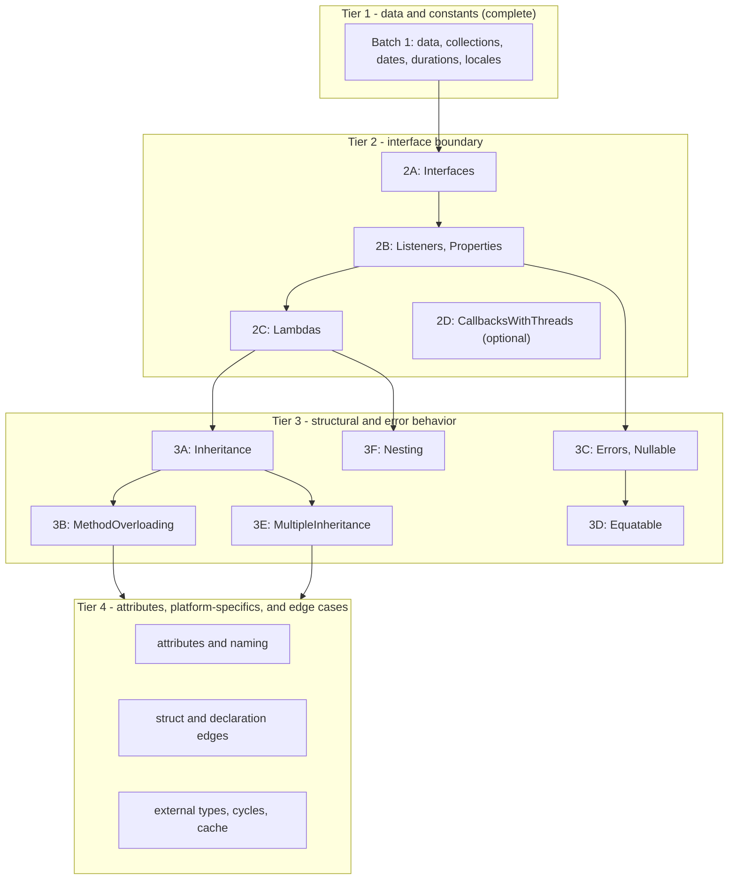

# JavaScript/Embind Generator - Phase 8 Status

**Status**: Batch 2D threaded callback coverage complete; native lambda-return support remains
deferred; all registered JavaScript functional coverage passes

**Date**: 2026-08-24

## Checkpoint Scope

The first Phase 8 checkpoint adds a Node.js functional-test harness modeled on the Python
functional tests in the parallel `gluecodium1` checkout. It now enables three feature groups for
the `js` generator:

- `Strings`: string parameters and returns, C-string conversion, overloaded static methods, and
  read-only static properties;
- `BuiltinTypes`: Boolean, Float, Double, signed and unsigned integer mappings, including 64-bit
  values as JavaScript `bigint`.
- `Enums`: enum member export and round-trip behavior, including enums used by type collections.
- `Constants`: scalar, enum, special numeric, class, struct, collection, and skipped constant
  behavior.
- `Structs`: public and nested value-object fields, object-literal input, field mutation, and
  accessor-backed C++ struct fields.
- `Blobs`: `std::shared_ptr<std::vector<uint8_t>>` conversion to and from JavaScript `Uint8Array`,
  including blobs nested in value objects, byte-buffer APIs, and nullable results.
- `Classes`: static factory construction, instance method mutation, shared-pointer round trips,
  referential aliasing, and explicit `delete()` disposal.
- `TypeDefs`: primitive, nested, blob, type-collection, and struct aliases through static class
  methods.
- `Defaults`: primitive, special numeric, empty collection, initializer collection, external enum,
  and struct defaults.
- `GenericTypes`: nested arrays, maps, sets, maps of arrays, and collection values involving
  structs.
- `Dates`: epoch-millisecond conversion for `Date`, nullable Date values, Date sets, and adapted
  static properties.
- `Durations`: native duration counts map to JavaScript `bigint` values, preserving parameter-level
  C++ type overrides.
- `Locales`: BCP-47 strings, nullable values, adapted static properties, Locale fields in value
  objects, defaults, and Locale list/set/map collections.

The harness uses Node's built-in `node:test` runner and CTest. CMake copies the test modules into
the build tree and passes the generated Emscripten module through `GLUECODIUM_JS_MODULE`.

Batch 2B adds JavaScript coverage for interface listener and property trampolines:

- `Listeners`: JavaScript implementations receive native callbacks and interface properties
  dispatch through generated wrappers;
- `ComplexListeners`: callbacks convert structs, collection aliases, enums, and blobs;
- `ListenersWithReturnValues`: callbacks return strings, structs, classes, enums, arrays, maps,
  and blobs through the native interface;
- `Properties`: readable and writable interface properties are exercised through JavaScript
  implementations.

Batch 2C adds the first lambda conversion slice:

- JavaScript functions passed to native lambda parameters are retained through `emscripten::val`
  captures and invoked with the generated C++ lambda signature;
- nullable lambda parameters, lambdas nested in collection parameters, overloaded lambda
  parameters, and lambda types declared inside structs are covered;
- native lambda returns and lambda-valued fields remain deferred because Emscripten embind does not
  register arbitrary `std::function` values as JavaScript-callable values. They require a separate
  callable-wrapper design and are not represented as passing Batch 2C coverage.

## Verification

With Emscripten 6.0.8 and Node.js available:

```bash
rm -rf build-functional-js
export GLUECODIUM_PATH="$PWD"
emcmake cmake -S functional-tests -B build-functional-js -G Ninja \
  -DGLUECODIUM_GENERATORS_DEFAULT='cpp;js' \
  -DFUNCTIONAL_BUILD_JS_TESTS=ON
cmake --build build-functional-js --target functional_bindings_js
ctest --test-dir build-functional-js --output-on-failure -R unit_tests_javascript
```

The generated module is compiled with `-sWASM_BIGINT=1`, and the Node tests assert `bigint` values
for `Long` and `ULong` methods. The focused Structs test passes all three cases. The focused
Classes test passes both cases, including instance mutation, shared-pointer round trips, and
referential aliasing. The registered `unit_tests_javascript` target passes all enabled JavaScript
functional test modules.
The focused Blobs test passes all four cases, including null shared pointers mapping to an empty
`Uint8Array` for non-nullable results and `undefined` for nullable results. Immutable structs and
structs containing immutable fields use generated `emscripten::val` adapters instead of embind
`value_object` registration. The adapters construct C++ structs from plain JavaScript objects and
convert returned structs back recursively, including nested structs, blobs, nullable fields, and
collection values. The `Blobs`, `Defaults`, and `PlainDataStructuresImmutable` fixtures are
covered by the JavaScript functional tests.
The Dates test passes for pre-epoch, epoch, and post-epoch values, nullable values, Date sets, and
static Date properties. Native Date values are converted through epoch milliseconds, with explicit
JavaScript numeric construction to avoid Emscripten `long long`/`bigint` coercion failures.
The Durations test passes for seconds and milliseconds, including sub-second millisecond values,
nullable results, duration value objects, and JavaScript `bigint` overload dispatch. Native duration
counts are exposed directly as `bigint`; generated embind helpers preserve the native duration type
when converting inputs, including parameter-level C++ type overrides.
The Locale-only test passes all four cases. The class tests load the generated public package
index, which maps the internal embind class names to the public JavaScript exports. The CMake
functional-test registration is limited to the feature groups and test modules currently covered
by the JavaScript generator.
Locale maps to JavaScript `string`; generated
adapters use the shared `gluecodium_locale_to_native` and `gluecodium_locale_to_js` helpers for
methods, properties, value-object fields, defaults, and collections.
The Batch 2B listener and property tests also pass in the clean Emscripten build. Callback
trampolines use JavaScript-value adapters for collection and struct aliases, recursively convert
callback arguments and return values, and expose native blobs as `Uint8Array` values.
The Batch 2C lambda tests pass in a fresh Emscripten 6.0.8 build. Direct, nullable, collection,
overloaded, and struct-defined JavaScript callbacks all use the same generated `emscripten::val`
adapter path. Native-created lambda returns still fail as unbound `std::function` values and are
explicitly deferred to the next lambda capability slice.

## Generator Fixes Exercised

The first tests found several embind generation defects that are fixed in this checkpoint:

- read-only instance properties emit getter-only `.property` registrations, while read-only
  static properties use a named getter function because embind has no function-based
  `.class_property` overload;
- overloaded functions use the typed adapter path so their C++ overload is resolved at generation
  output compile time.
- generated struct field pointers use C++ name resolution, preserving native names such as
  `set_field` when the JavaScript name is `setField`;
- accessor-backed structs use typed non-capturing getter/setter function pointers for embind
  `value_object` fields, preserving C++ reference signatures for nontrivial values;
- generic vector/map/optional registrations include the C++ headers needed by their element types;
- enum bindings avoid Emscripten runtime names such as `InternalError` by using a distinct embind
  public name while retaining the generated C++ type identity.
- Blob adapters convert JavaScript typed arrays with `convertJSArrayToNumberVector` and convert
  native byte vectors back with `emscripten::val::array`, guarding nullable shared pointers.
- package facades attach generated scalar, enum, and struct constants to their owning runtime
  exports, preserve nested-name compatibility, and use an empty-object fallback for value objects
  whose embind constructor is unavailable.
- collection-bearing struct fields use explicit `emscripten::val` adapters, allowing native
  `std::vector`, `std::unordered_map`, and `std::unordered_set` fields to cross the JS boundary
  without relying on unsupported unordered-container embind registrations.
- Date adapters convert `std::chrono::system_clock::time_point` through epoch milliseconds, map
  nullable results to the existing JS `undefined` convention, and expose adapted static properties
  through hidden embind accessors plus runtime `Object.defineProperty` descriptors.
- Duration adapters convert native `std::chrono::duration` counts to JavaScript `bigint` values and
  back through shared embind helpers, preserving seconds and milliseconds overrides. Same-arity
  static overloads use private embind registration names and a generated JavaScript type dispatcher;
  methods with distinct JavaScript names retain their public embind registrations.
- nested C++ type references in collection converters and external enum values use fully qualified
  C++ names; local CMake builds propagate owner-target include directories to the JS module target.
- Locale adapters convert BCP-47 strings through the generated native `Locale` type, preserving
  language, script, and country components when returning a language tag.
- Interface wrappers canonicalize initialized embind handles passed as arguments. The wrapper
  runtime uses a pointer-based alias fallback when Emscripten's `isAliasOf` cannot compare
  interface handles with non-writable internal `$$` properties, and preserves shared `__Wrapper`
  handles instead of eagerly deleting them during canonicalization.
- Interface callback trampolines adapt collection and struct aliases through `emscripten::val`,
  recursively convert callback arguments and return values, preserve `@Cpp(Const)` methods, and
  construct callback blobs as JavaScript `Uint8Array` instances.
- Threaded interface and lambda callbacks dispatch synchronously to the main Emscripten runtime
  thread. Runtime-thread-owned value holders defer `emscripten::val` destruction, and interface
  adapters preserve embind smart-pointer identity so JavaScript subclass prototypes survive native
  round trips. Runtime-thread teardown calls `__destruct` to unregister inherited instances.
- Lambda parameters use the recursive JavaScript-to-native conversion path, including nullable
  lambdas and lambdas nested inside collections; native lambda returns remain outside this slice
  until a callable embind wrapper is designed.
- Static properties use named getter and setter functions for Emscripten compatibility, and
  adapted static constructors and methods use function-pointer lambdas to resolve Embind
  overloads reliably.

## Lessons Learned

- Treat LimeIDL inputs as a dependency-closed set for each feature. `StaticTypedef.lime` references
  `TypeCollection.PointTypedef`, so the TypeDefs feature must include `TypeCollection.lime` or model
  validation and generation will fail before the JS bindings are produced.
- CMake generation runs the Gradle wrapper project under `cmake/modules/gluecodium/gluecodium/details`,
  which normally resolves the published Gluecodium artifact. Set `GLUECODIUM_PATH="$PWD"` when
  validating local generator changes; running the repository root's `./gradlew run` is not an
  equivalent replacement and can hide or create misleading ServiceLoader/provider failures.
- Direct Gluecodium generation updates `main/js`, but the package copied beside the Emscripten module
  is produced by the JS target's `POST_BUILD` step. Rebuild the module after generation, and use the
  same local-generator setting, or Node tests may import stale package indexes.
- CMake copies Node test modules into the build tree during configuration and constructs the CTest
  command from the configured file list. After adding or changing test registration, rerun the CMake
  configure step, or use a clean build directory, before running CTest; a compile-only rerun can
  execute an older copied test set.
- The generated binding rule does not track Mustache template changes as Ninja dependencies. When a
  runtime template changes, rebuild with `--clean-first` (or remove the build directory) before
  interpreting test results, otherwise the Emscripten module may still contain stale generated code.
- A type alias does not create an embind runtime object. The package facade must export the owning
  class or struct that contains alias-using methods; TypeScript alias declarations alone do not make
  a runtime `StaticTypedef` export appear.
- Register every new Node test in both parts of `functional-tests/functional/js/CMakeLists.txt`:
  `configure_file` copies the test into the build tree, while the `add_test` file list is what executes
  it.

## Batch 1 Result

Batch 1 implementation is complete for the JavaScript generator. Locale and class behavior are
verified with focused test commands, and the broader registered suite passes in a clean build. The
Node.js harness passes explicit test-file paths
because the Node versions tested locally (22.13.1, 22.19.0, 23.6.1, 24.16.0, and 25.7.0) treat a
directory argument to `node --test` as a module entry rather than a test collection.

## Next Work

The next iteration starts with `Lambdas` as the next unverified interface capability
probe. The Node versions tested locally (22.13.1, 22.19.0, 23.6.1, 24.16.0, and 25.7.0) all
treat a directory argument to `node --test` as a module entry rather than a test collection, so
the harness passes explicit test-file paths.

The original feature groups are not all dependency-isolated. The `Inheritance` CMake feature
also includes listener-inheritance and interface-lambda fixtures, and `MethodOverloading`
includes `InheritanceOverloads.lime`. The revised plan therefore uses capability slices and
explicit preflight checks instead of assuming that a feature name is a single capability. If a
feature bundle cannot be enabled without pulling in a later capability, split the fixture or add a
focused test at the earlier capability gate before enabling the bundle.

## Feature Enablement Plan

This is the working plan for enabling the remaining functional-test coverage for the `js`
generator. Each capability slice builds only on behavior proven by an earlier slice. A slice ends
with the relevant `feature(...)` line gaining `js`, a new focused
`js/tests/<feature>.test.mjs` file registered in `functional-tests/functional/js/CMakeLists.txt`,
and a green `ctest -R unit_tests_javascript` run. A slice may be split further when a legacy CMake
feature bundles fixtures from a later slice.

### Current state (already enabled and passing)

| Feature | Notes |
|---------|-------|
| Strings | string params/returns, C-string conversion, overloads, static properties |
| BuiltinTypes | Boolean/Float/Double/int mappings; 64-bit as `bigint` |
| Enums | member export, round-trip, type-collection enums |
| Structs | value objects, nested structs, object-literal input, accessors |
| Blobs | `shared_ptr<vector<uint8_t>>` <-> `Uint8Array`, nullable results |
| Classes | factories, instance methods, shared-pointer aliasing, explicit `delete()` |
| Constants | scalar, enum, struct, collection, and skipped constant exports |
| TypeDefs | primitive, nested, blob, type-collection, and struct aliases |
| Defaults | primitive, special numeric, collection, external enum, and struct defaults |
| GenericTypes | nested arrays, maps, sets, and collection values involving structs |
| Dates | epoch-millisecond conversion, nullable values, sets, static properties |
| Durations | duration counts and value objects exposed as JavaScript `bigint` |
| Locales | BCP-47 strings, nullable values, fields, defaults, and collections |
| Interfaces | JS-created implementations, native dispatch, nested interface round trips, and properties |
| Listeners | JS listener implementations and native callback dispatch |
| ComplexListeners | struct, collection alias, enum, and blob callback arguments |
| ListenersWithReturnValues | scalar, struct, class, enum, collection, and blob callback returns |
| Properties | interface getter and setter dispatch through JS implementations |

### Dependency analysis

The remaining work is best treated as four capability tiers with smaller gates inside the first
two. Tier boundaries are set by the generated runtime behavior and by the actual LimeIDL fixture
bundles, not only by the feature labels:



Key dependencies observed in the fixtures:

#### Batch 2A - interface core

Feature: `Interfaces`.

Add `js` to the `Interfaces` feature and use it as the first direct probe of generated
`allow_subclass<Wrapper>` support. Cover JS-created implementations, pure virtual dispatch,
nested interface references, shared-pointer round trips, and `InterfaceWithProperty`. Do not infer
listener support from this batch; keep listener callbacks as the next gate.

#### Batch 2B - listener and property trampolines (complete)

Features: `Listeners`, `ComplexListeners`, `ListenersWithReturnValues`, `Properties`.

These fixtures depend on JS-side interface implementations. `ListenerRoundtrip` verifies
referential equality through the wrapper cache, `ListenerWithMaps` combines callbacks with generic
containers, and `ListenersWithReturnValues` exercises interface methods returning structs, enums,
classes, collections, and blobs. `Properties` belongs here because `AttributesInterface.lime`
requires an interface implementation with readable and writable properties.

The implemented tests are `listeners.test.mjs`, `listener-maps.test.mjs`,
`complex-listeners.test.mjs`, and `listener-return-values.test.mjs`. The generated callback
trampolines use explicit JavaScript-value conversion whenever callback types include collection or
struct aliases, and blob callback values are returned as `Uint8Array` instances.

#### Batch 2C - lambda conversions (initial input slice complete)

Feature: `Lambdas`.

The initial slice covers JavaScript functions passed to native callable parameters, including
nullable lambda parameters, lambdas nested in collections, overloaded lambda parameters, and
lambda types declared inside structs. The generated adapters capture each function as an
`emscripten::val` and invoke it through the native lambda signature. Native-created lambda returns
and lambda-valued struct fields remain deferred because embind reports their raw `std::function`
types as unbound. Before enabling the broader `Inheritance` feature, either move its
`InterfaceWithLambda.lime` fixture into this slice or run it as an explicit lambda preflight;
`Inheritance` currently bundles that fixture.

#### Batch 2D - threaded callbacks (implemented)

Feature: `CallbacksWithThreads`.

The implementation handles callbacks originating on native worker/render threads while keeping
JavaScript execution and `emscripten::val` ownership on the main Emscripten runtime thread.
Generated interface trampolines and lambda adapters synchronously dispatch through
`emscripten_sync_run_in_main_runtime_thread`, so native callers retain their normal return-value
semantics while JavaScript callbacks run on the owning thread. Void and value-returning callbacks
use separate helpers, avoiding invalid `std::optional<void>` instantiations.

The runtime helpers address the two ownership hazards exposed by detached callbacks:

- JavaScript functions and interface wrappers are held by runtime-thread-owned `emscripten::val`
  containers. Their deleters dispatch destruction back to the main runtime thread instead of
  releasing a thread-affine `val` on the worker.
- Interface parameters preserve embind smart-pointer identity while their final destruction is
  deferred. This keeps inherited JavaScript subclass instances and custom prototype properties
  intact during native round trips, while avoiding embind's worker-thread `val` deleter. Interface
  wrapper teardown invokes embind `__destruct` on the runtime thread so inherited-instance
  registry entries are removed before native pointer addresses are reused.

The `--no-entry` generated module exposes `pumpRuntimeQueue()` and the test host pumps it from a
timer. This is the explicit queue boundary required by the current module configuration; it does
not introduce a second callback-executor API. The JavaScript functional build enables
`CallbacksWithThreads`, copies `callbacks-with-threads.test.mjs`, and registers detached interface
and detached lambda callback cases with CTest.

Validation with Emscripten 6.0.8 and Node.js passes the complete `unit_tests_javascript` target:
all 38 tests pass, including existing listener round trips, interface properties, lambda input,
and both native-thread callback paths.

#### Batch 3A - single inheritance

Feature: `Inheritance`.

Prove one primary `base<>`, overridden interface methods, class inheritance, cross-package parents,
and wrapper identity. The existing feature also includes `ListenerInheritance.lime`,
`ListenerInheritanceArrays.lime`, and `InterfaceWithLambda.lime`; treat those as dependency-closure
checks, or split them before enabling the complete feature.

#### Batch 3B - inherited method overloads

Feature: `MethodOverloading`.

Static overloads are already covered by earlier batches. This feature must follow inheritance
because its CMake bundle includes `InheritanceOverloads.lime`; test instance overloads on interfaces
and classes after primary-base dispatch is working.

#### Batch 3C - errors and nullable values

Features: `Errors`, `Nullable`.

`ErrorsInInterface.lime` requires interface trampolines in addition to error conversion. Test
`Return<T, Error>` to JavaScript exceptions for ordinary and interface methods. `Nullable` then
covers optional scalars, strings, structs, enums, collections, instances, and nullable listener
parameters/properties. Run the two feature tests separately even if they share a batch gate.

#### Batch 3D - equality semantics

Feature: `Equatable`.

This is not intrinsically an inheritance feature, but its fixtures combine immutable structs,
nullable fields, collections, and class references. Place it after the nullable and immutable
conversion paths are stable; verify both value equality and referential equality.

#### Batch 3E - multiple inheritance

Feature: `MultipleInheritance`.

Run after single inheritance. The JS generator supports one primary `base<>` registration and
flattens secondary-parent functions and properties, so test both primary-base identity and the
flattened secondary members.

#### Batch 3F - nested declarations

Feature: `Nesting`.

Run after interface and lambda conversions. Its fixtures include nested interfaces, classes,
structs, enums, typedefs, and lambdas exposed through interface-returned values.

#### Batch 4 - attributes, naming, and structural edges

Features: `Visibility`, `SkipAttribute`, `Comments`, `PlatformNames`, `EscapedNames`,
`UnderscorePackage`, `CrossPackageNameClash`, `DeclarationOrder`, `StructsWithCompanion`,
`FieldConstructors`, `StructsInTypes`, `StructsImmutable`, `InstanceInStruct`, `CppConst`,
`CppNoexcept`.

- Verify filtering and naming correctness: `@Js(Skip)`/`@EnableIf`, internal visibility, JSDoc,
  keyword escaping, package paths, and duplicate leaf names across packages.
- `FieldConstructors` and `StructsImmutable` now use the generated `emscripten::val` adapter path
  for immutable structs rather than relying on default-constructible embind `value_object`s.
- `InstanceInStruct` verifies shared-pointer field conversion inside value objects.
- `CppConst` and `CppNoexcept` can join this batch because the qualifiers are transparent to embind
  signatures.

#### Batch 5 - external types, circular dependencies, and deferred items

Features: `ExternalTypes`, `CircularDependencies`, `NoCache`, `Serialization`, `FullName`.

- `ExternalTypes` binds pre-existing C++ types and requires the generator to emit bindings for types
  it does not define; run it only after ordinary classes, structs, interfaces, and package facade
  exports are stable.
- `CircularDependencies` verifies include order and header resolution in generated embind sources.
- `NoCache` verifies that regenerated output and the `.wasm` rebuild remain consistent.
- `Serialization` is Android-only today; keep it deferred unless a JS serialization contract is
  defined.
- `FullName` is Dart-only today; enable it only if JS naming-rule coverage needs it.
- Defer `Async`, `WeakListeners`, and platform-specific external-type fixtures until their runtime
  capabilities are available.

### Per-batch workflow

1. Resolve the fixture dependency closure. If a feature bundle includes a later capability, split
  the fixture or record the explicit preflight that must pass first.
2. Add `js` to the relevant `feature(...)` line in `functional-tests/functional/CMakeLists.txt`
  and add required C++ test sources.
3. Create `functional-tests/functional/js/tests/<feature>.test.mjs`, then register it in
  `js/CMakeLists.txt` with both `configure_file` and the `add_test` file list.
4. Rebuild with `cmake --build build-functional-js --target functional_bindings_js`; iterate on
  generator and template defects until compilation succeeds.
5. Run `ctest --test-dir build-functional-js --output-on-failure -R unit_tests_javascript` and, when
  useful, run the new test module directly with `node --test`.
6. Record generator fixes, fixture splits, deferred capabilities, and permanently skipped fixtures
  in this document.

### Progress tracking

| Batch | Features | Status |
|-------|----------|--------|
| 0 | Strings, BuiltinTypes, Enums, Structs, Blobs, Classes | passing |
| 1 | Constants, TypeDefs, Defaults, GenericTypes, Dates, Durations, Locales | passing |
| 2A | Interfaces | passing |
| 2B | Listeners, ComplexListeners, ListenersWithReturnValues, Properties | blocked on 2A |
| 2C | Lambdas (JavaScript-input callbacks) | passing; native lambda returns deferred |
| 2D | CallbacksWithThreads | passing; detached interface and lambda callbacks |
| 3A | Inheritance | blocked on 2A-2C and fixture closure |
| 3B | MethodOverloading | blocked on 3A and fixture closure |
| 3C | Errors, Nullable | blocked on interface and optional conversion gates |
| 3D | Equatable | blocked on nullable and immutable conversion gates |
| 3E | MultipleInheritance | blocked on 3A |
| 3F | Nesting | blocked on interface and lambda gates |
| 4 | Visibility, SkipAttribute, Comments, PlatformNames, EscapedNames, UnderscorePackage, CrossPackageNameClash, DeclarationOrder, StructsWithCompanion, FieldConstructors, StructsInTypes, StructsImmutable, InstanceInStruct, CppConst, CppNoexcept | not started |
| 5 | ExternalTypes, CircularDependencies, NoCache, Serialization, FullName | not started |
| - | Async, WeakListeners, JavaKotlin/Dart/Swift ExternalTypes | deferred / not applicable |