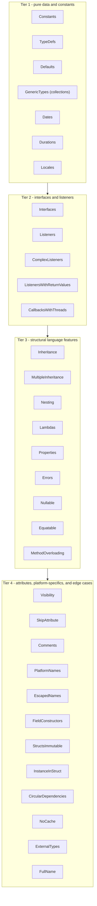

# JavaScript/Embind Generator - Phase 8 Status

**Status**: Batch 1 implementation complete; all registered JavaScript functional coverage passes

**Date**: 2026-08-24

## Checkpoint Scope

The first Phase 8 checkpoint adds a Node.js functional-test harness modeled on the Python
functional tests in the parallel `gluecodium1` checkout. It now enables three feature groups for
the `js` generator:

- `Strings`: string parameters and returns, C-string conversion, overloaded static methods, and
  read-only static properties;
- `BuiltinTypes`: Boolean, Float, Double, signed and unsigned integer mappings, including 64-bit
  values as JavaScript `bigint`.
- `Enums`: enum member export and round-trip behavior, including enums used by type collections.
- `Constants`: scalar, enum, special numeric, class, struct, collection, and skipped constant
  behavior.
- `Structs`: public and nested value-object fields, object-literal input, field mutation, and
  accessor-backed C++ struct fields.
- `Blobs`: `std::shared_ptr<std::vector<uint8_t>>` conversion to and from JavaScript `Uint8Array`,
  including blobs nested in value objects, byte-buffer APIs, and nullable results.
- `Classes`: static factory construction, instance method mutation, shared-pointer round trips,
  referential aliasing, and explicit `delete()` disposal.
- `TypeDefs`: primitive, nested, blob, type-collection, and struct aliases through static class
  methods.
- `Defaults`: primitive, special numeric, empty collection, initializer collection, external enum,
  and struct defaults.
- `GenericTypes`: nested arrays, maps, sets, maps of arrays, and collection values involving
  structs.
- `Dates`: epoch-millisecond conversion for `Date`, nullable Date values, Date sets, and adapted
  static properties.
- `Durations`: native duration counts map to JavaScript `bigint` values, preserving parameter-level
  C++ type overrides.
- `Locales`: BCP-47 strings, nullable values, adapted static properties, Locale fields in value
  objects, defaults, and Locale list/set/map collections.

The harness uses Node's built-in `node:test` runner and CTest. CMake copies the test modules into
the build tree and passes the generated Emscripten module through `GLUECODIUM_JS_MODULE`.

## Verification

With Emscripten and Node.js available:

```bash
rm -rf build-functional-js
export GLUECODIUM_PATH="$PWD"
emcmake cmake -S functional-tests -B build-functional-js -G Ninja \
  -DGLUECODIUM_GENERATORS_DEFAULT='cpp;js' \
  -DFUNCTIONAL_BUILD_JS_TESTS=ON
cmake --build build-functional-js --target functional_bindings_js
ctest --test-dir build-functional-js --output-on-failure -R unit_tests_javascript
```

The generated module is compiled with `-sWASM_BIGINT=1`, and the Node tests assert `bigint` values
for `Long` and `ULong` methods. The focused Structs test passes all three cases. The focused
Classes test passes both cases, including instance mutation, shared-pointer round trips, and
referential aliasing. The registered `unit_tests_javascript` target passes all enabled JavaScript
functional test modules.
The focused Blobs test passes all four cases, including null shared pointers mapping to an empty
`Uint8Array` for non-nullable results and `undefined` for nullable results. Immutable structs and
structs containing immutable fields use generated `emscripten::val` adapters instead of embind
`value_object` registration. The adapters construct C++ structs from plain JavaScript objects and
convert returned structs back recursively, including nested structs, blobs, nullable fields, and
collection values. The `Blobs`, `Defaults`, and `PlainDataStructuresImmutable` fixtures are
covered by the JavaScript functional tests.
The Dates test passes for pre-epoch, epoch, and post-epoch values, nullable values, Date sets, and
static Date properties. Native Date values are converted through epoch milliseconds, with explicit
JavaScript numeric construction to avoid Emscripten `long long`/`bigint` coercion failures.
The Durations test passes for seconds and milliseconds, including sub-second millisecond values,
nullable results, duration value objects, and JavaScript `bigint` overload dispatch. Native duration
counts are exposed directly as `bigint`; generated embind helpers preserve the native duration type
when converting inputs, including parameter-level C++ type overrides.
The Locale-only test passes all four cases. The class tests load the generated public package
index, which maps the internal embind class names to the public JavaScript exports. The CMake
functional-test registration is limited to the feature groups and test modules currently covered
by the JavaScript generator.
Locale maps to JavaScript `string`; generated
adapters use the shared `gluecodium_locale_to_native` and `gluecodium_locale_to_js` helpers for
methods, properties, value-object fields, defaults, and collections.

## Generator Fixes Exercised

The first tests found several embind generation defects that are fixed in this checkpoint:

- read-only instance properties emit getter-only `.property` registrations, while read-only
  static properties use a named getter function because embind has no function-based
  `.class_property` overload;
- overloaded functions use the typed adapter path so their C++ overload is resolved at generation
  output compile time.
- generated struct field pointers use C++ name resolution, preserving native names such as
  `set_field` when the JavaScript name is `setField`;
- accessor-backed structs use typed non-capturing getter/setter function pointers for embind
  `value_object` fields, preserving C++ reference signatures for nontrivial values;
- generic vector/map/optional registrations include the C++ headers needed by their element types;
- enum bindings avoid Emscripten runtime names such as `InternalError` by using a distinct embind
  public name while retaining the generated C++ type identity.
- Blob adapters convert JavaScript typed arrays with `convertJSArrayToNumberVector` and convert
  native byte vectors back with `emscripten::val::array`, guarding nullable shared pointers.
- package facades attach generated scalar, enum, and struct constants to their owning runtime
  exports, preserve nested-name compatibility, and use an empty-object fallback for value objects
  whose embind constructor is unavailable.
- collection-bearing struct fields use explicit `emscripten::val` adapters, allowing native
  `std::vector`, `std::unordered_map`, and `std::unordered_set` fields to cross the JS boundary
  without relying on unsupported unordered-container embind registrations.
- Date adapters convert `std::chrono::system_clock::time_point` through epoch milliseconds, map
  nullable results to the existing JS `undefined` convention, and expose adapted static properties
  through hidden embind accessors plus runtime `Object.defineProperty` descriptors.
- Duration adapters convert native `std::chrono::duration` counts to JavaScript `bigint` values and
  back through shared embind helpers, preserving seconds and milliseconds overrides. Same-arity
  static overloads use private embind registration names and a generated JavaScript type dispatcher;
  methods with distinct JavaScript names retain their public embind registrations.
- nested C++ type references in collection converters and external enum values use fully qualified
  C++ names; local CMake builds propagate owner-target include directories to the JS module target.
- Locale adapters convert BCP-47 strings through the generated native `Locale` type, preserving
  language, script, and country components when returning a language tag.

## Lessons Learned

- Treat LimeIDL inputs as a dependency-closed set for each feature. `StaticTypedef.lime` references
  `TypeCollection.PointTypedef`, so the TypeDefs feature must include `TypeCollection.lime` or model
  validation and generation will fail before the JS bindings are produced.
- CMake generation runs the Gradle wrapper project under `cmake/modules/gluecodium/gluecodium/details`,
  which normally resolves the published Gluecodium artifact. Set `GLUECODIUM_PATH="$PWD"` when
  validating local generator changes; running the repository root's `./gradlew run` is not an
  equivalent replacement and can hide or create misleading ServiceLoader/provider failures.
- Direct Gluecodium generation updates `main/js`, but the package copied beside the Emscripten module
  is produced by the JS target's `POST_BUILD` step. Rebuild the module after generation, and use the
  same local-generator setting, or Node tests may import stale package indexes.
- A type alias does not create an embind runtime object. The package facade must export the owning
  class or struct that contains alias-using methods; TypeScript alias declarations alone do not make
  a runtime `StaticTypedef` export appear.
- Register every new Node test in both parts of `functional-tests/functional/js/CMakeLists.txt`:
  `configure_file` copies the test into the build tree, while the `add_test` file list is what executes
  it.

## Batch 1 Result

Batch 1 implementation is complete for the JavaScript generator. Locale and class behavior are
verified with focused test commands, and the broader registered suite passes in a clean build. The
Node.js harness passes explicit test-file paths
because the Node versions tested locally (22.13.1, 22.19.0, 23.6.1, 24.16.0, and 25.7.0) treat a
directory argument to `node --test` as a module entry rather than a test collection.

## Next Work

The next iteration should enable the next feature group one at a time. The Node versions tested
locally (22.13.1, 22.19.0, 23.6.1, 24.16.0, and 25.7.0) all treat a directory argument to
`node --test` as a module entry rather than a test collection, so the harness passes explicit
test-file paths.

## Feature Enablement Plan

This is the working plan for enabling the remaining functional-test feature groups for the `js`
generator. Each batch builds only on capabilities proven by the previous batches. Each batch ends
with the feature's `feature(...)` line gaining `js`, a new `js/tests/<feature>.test.mjs` file
registered in `functional-tests/functional/js/CMakeLists.txt`, and a green
`ctest -R unit_tests_javascript` run.

### Current state (already enabled and passing)

| Feature | Notes |
|---------|-------|
| Strings | string params/returns, C-string conversion, overloads, static properties |
| BuiltinTypes | Boolean/Float/Double/int mappings; 64-bit as `bigint` |
| Enums | member export, round-trip, type-collection enums |
| Structs | value objects, nested structs, object-literal input, accessors |
| Blobs | `shared_ptr<vector<uint8_t>>` <-> `Uint8Array`, nullable results |
| Classes | factories, instance methods, shared-pointer aliasing, explicit `delete()` |
| Constants | scalar, enum, struct, collection, and skipped constant exports |
| TypeDefs | primitive, nested, blob, type-collection, and struct aliases |
| Defaults | primitive, special numeric, collection, external enum, and struct defaults |
| GenericTypes | nested arrays, maps, sets, and collection values involving structs |
| Dates | epoch-millisecond conversion, nullable values, sets, static properties |
| Durations | duration counts and value objects exposed as JavaScript `bigint` |
| Locales | BCP-47 strings, nullable values, fields, defaults, and collections |

### Dependency analysis

The remaining features decompose into four dependency tiers. Tier boundaries are set by which
generator capabilities each feature first exercises:



Key dependencies observed in the fixtures:

- **Interfaces before Listeners**: listener fixtures declare an interface implemented on the JS
  side, requiring embind `allow_subclass<Wrapper>` trampolines. `Interfaces.lime` is the minimal
  probe for this capability.
- **Properties needs Interfaces**: `AttributesInterface.lime` defines an interface whose JS-side
  implementation provides attribute values, so it belongs with the listener tier.
- **Errors needs interfaces**: `ErrorsInInterface.lime` throws from an interface method, so error
  mapping is verified together with or after trampoline work.
- **Nullable needs struct and class support**: optional scalars, strings, structs, and instance
  references build on the optional caster and registrations proven by the completed batches.
- **MultipleInheritance follows Inheritance**: primary-base registration plus flattened
  secondary-parent members must come after plain `Inheritance` proves `base<>` registration.
- **ExternalTypes is late**: embind must bind pre-existing C++ types it does not own, together with
  the relevant platform filtering behavior.
- **Async is explicitly deferred**: enable it only after Asyncify/JSPI support lands.

### Batch order

#### Batch 2 - interfaces, listeners, and callbacks

Features: `Interfaces`, `Listeners`, `ComplexListeners`, `ListenersWithReturnValues`,
`CallbacksWithThreads`, `Properties`.

- New capability: JS-implemented interfaces via `allow_subclass<Wrapper>` trampolines and JS
  function objects held in `emscripten::val`.
- `ListenerRoundtrip` verifies referential equality through the wrapper cache when a JS-created
  object round-trips C++ -> JS -> C++ -> JS.
- `ListenerWithMaps` combines generic containers with callback parameters.
- `Properties` is the first test of property access through trampolines.
- Attempt `CallbacksWithThreads` last in this batch; defer it alone if pthread marshalling is not
  wired into the harness.

#### Batch 3 - inheritance and structural language features

Features: `MethodOverloading`, `Errors`, `Nullable`, `Equatable`, `Inheritance`,
`MultipleInheritance`, `Nesting`, `Lambdas`.

- `MethodOverloading` adds instance-method overloads through typed adapters; static overloads are
  already proven in Strings.
- `Errors` maps `Return<T, Error>` to a thrown JavaScript `Error` subclass, including interface
  methods.
- `Nullable` covers optional scalars, strings, structs, and instances.
- `Equatable` covers `@Equatable` structs and reference-equality semantics through the wrapper cache.
- `Inheritance` proves single-base registration, overridden methods, and cross-package parents.
- `MultipleInheritance` uses primary-base registration plus flattened secondary members.
- `Nesting` covers nested classes, enums, structs, lambdas, and typedefs as return values.
- `Lambdas` builds on `emscripten::val` callable handling from the interface batch.

#### Batch 4 - attributes, naming, and platform-specific behavior

Features: `Visibility`, `SkipAttribute`, `Comments`, `PlatformNames`, `EscapedNames`,
`UnderscorePackage`, `CrossPackageNameClash`, `DeclarationOrder`, `StructsWithCompanion`,
`FieldConstructors`, `StructsInTypes`, `StructsImmutable`, `InstanceInStruct`, `CppConst`,
`CppNoexcept`.

- Verify filtering and naming correctness: `@Js(Skip)`/`@EnableIf`, internal visibility, JSDoc,
  keyword escaping, package paths, and duplicate leaf names across packages.
- `FieldConstructors` and `StructsImmutable` now use the generated `emscripten::val` adapter path
  for immutable structs rather than relying on default-constructible embind `value_object`s.
- `InstanceInStruct` verifies shared-pointer field conversion inside value objects.
- `CppConst` and `CppNoexcept` can join this batch because the qualifiers are transparent to embind
  signatures.

#### Batch 5 - external types, circular dependencies, and deferred items

Features: `ExternalTypes`, `CircularDependencies`, `NoCache`, `Serialization`, `FullName`.

- `ExternalTypes` binds pre-existing C++ types and requires the generator to emit bindings for types
  it does not define.
- `CircularDependencies` verifies include order and header resolution in generated embind sources.
- `NoCache` verifies that regenerated output and the `.wasm` rebuild remain consistent.
- `Serialization` is Android-only today; keep it deferred unless a JS serialization contract is
  defined.
- `FullName` is Dart-only today; enable it only if JS naming-rule coverage needs it.
- Defer `Async`, `WeakListeners`, and platform-specific external-type fixtures until their runtime
  capabilities are available.

### Per-batch workflow

1. Add `js` to the `feature(...)` lines for the batch in `functional-tests/functional/CMakeLists.txt`
   and add required C++ test sources.
2. Create `functional-tests/functional/js/tests/<feature>.test.mjs`, then register it in
   `js/CMakeLists.txt` with both `configure_file` and the `add_test` file list.
3. Rebuild with `cmake --build build-functional-js --target functional_bindings_js`; iterate on
   generator and template defects until compilation succeeds.
4. Run `ctest --test-dir build-functional-js --output-on-failure -R unit_tests_javascript` until
   the registered suite is green.
5. Record generator fixes and permanently skipped fixtures in this document.

### Progress tracking

| Batch | Features | Status |
|-------|----------|--------|
| 0 | Strings, BuiltinTypes, Enums, Structs, Blobs, Classes | passing |
| 1 | Constants, TypeDefs, Defaults, GenericTypes, Dates, Durations, Locales | passing |
| 2 | Interfaces, Listeners, ComplexListeners, ListenersWithReturnValues, CallbacksWithThreads, Properties | not started |
| 3 | MethodOverloading, Errors, Nullable, Equatable, Inheritance, MultipleInheritance, Nesting, Lambdas | not started |
| 4 | Visibility, SkipAttribute, Comments, PlatformNames, EscapedNames, UnderscorePackage, CrossPackageNameClash, DeclarationOrder, StructsWithCompanion, FieldConstructors, StructsInTypes, StructsImmutable, InstanceInStruct, CppConst, CppNoexcept | not started |
| 5 | ExternalTypes, CircularDependencies, NoCache, Serialization, FullName | not started |
| - | Async, WeakListeners, JavaKotlin/Dart/Swift ExternalTypes | deferred / not applicable |