# JavaScript/Embind Generator - Phase 8 Status

**Status**: In progress; Strings, BuiltinTypes, Enums, Structs, Blobs, Classes, and TypeDefs Node.js functional coverage is passing

**Date**: 2026-08-23

## Checkpoint Scope

The first Phase 8 checkpoint adds a Node.js functional-test harness modeled on the Python
functional tests in the parallel `gluecodium1` checkout. It now enables three feature groups for
the `js` generator:

- `Strings`: string parameters and returns, C-string conversion, overloaded static methods, and
  read-only static properties;
- `BuiltinTypes`: Boolean, Float, Double, signed and unsigned integer mappings, including 64-bit
  values as JavaScript `bigint`.
- `Enums`: enum member export and round-trip behavior, including enums used by type collections.
- `Structs`: public and nested value-object fields, object-literal input, field mutation, and
  accessor-backed C++ struct fields.
- `Blobs`: `std::shared_ptr<std::vector<uint8_t>>` conversion to and from JavaScript `Uint8Array`,
  including blobs nested in value objects, byte-buffer APIs, and nullable results.
- `Classes`: static factory construction, instance method mutation, shared-pointer round trips,
  referential aliasing, and explicit `delete()` disposal.
- `TypeDefs`: primitive, nested, blob, type-collection, and struct aliases through static class methods.

The harness uses Node's built-in `node:test` runner and CTest. CMake copies the test modules into
the build tree and passes the generated Emscripten module through `GLUECODIUM_JS_MODULE`.

## Verification

With Emscripten and Node.js available:

```bash
rm -rf build-functional-js
export GLUECODIUM_PATH="$PWD"
emcmake cmake -S functional-tests -B build-functional-js -G Ninja \
  -DGLUECODIUM_GENERATORS_DEFAULT='cpp;js' \
  -DFUNCTIONAL_BUILD_JS_TESTS=ON
cmake --build build-functional-js --target functional_bindings_js
ctest --test-dir build-functional-js --output-on-failure -R unit_tests_javascript
```

The build and filtered CTest run pass for the checkpoint scope. The generated module is compiled
with `-sWASM_BIGINT=1`, and the Node tests assert `bigint` values for `Long` and `ULong` methods.
The focused Structs test passes all three cases, and `unit_tests_javascript` passes through CTest.
The focused Blobs test passes all four cases, including null shared pointers mapping to an empty
`Uint8Array` for non-nullable results and `undefined` for nullable results. The immutable Blob
value-object fixture remains skipped for JS because embind `value_object` bindings require a
default-constructible, writable class without custom construction support.
The focused Classes test passes both cases, including shared-pointer aliasing through nested class
values and explicit disposal of embind handles.

## Lessons Learned

- Treat LimeIDL inputs as a dependency-closed set for each feature. `StaticTypedef.lime` references
  `TypeCollection.PointTypedef`, so the TypeDefs feature must include `TypeCollection.lime` or model
  validation and generation will fail before the JS bindings are produced.
- CMake generation runs the Gradle wrapper project under `cmake/modules/gluecodium/gluecodium/details`,
  which normally resolves the published Gluecodium artifact. Set `GLUECODIUM_PATH="$PWD"` when
  validating local generator changes; running the repository root's `./gradlew run` is not an equivalent
  replacement and can hide or create misleading ServiceLoader/provider failures.
- Direct Gluecodium generation updates `main/js`, but the package copied beside the Emscripten module
  is produced by the JS target's `POST_BUILD` step. Rebuild the module after generation, and use the
  same local-generator setting, or Node tests may import stale package indexes.
- A type alias does not create an embind runtime object. The package facade must export the owning class
  or struct that contains alias-using methods; TypeScript alias declarations alone do not make a runtime
  `StaticTypedef` export appear.
- Register every new Node test in both parts of `functional-tests/functional/js/CMakeLists.txt`:
  `configure_file` copies the test into the build tree, while the `add_test` file list is what executes it.

## Generator Fixes Exercised

The first tests found several embind generation defects that are fixed in this checkpoint:

- read-only instance properties emit getter-only `.property` registrations, while read-only
  static properties use a named getter function because embind has no function-based
  `.class_property` overload;
- overloaded functions use the typed adapter path so their C++ overload is resolved at generation
  output compile time.
- generated struct field pointers use C++ name resolution, preserving native names such as
  `set_field` when the JavaScript name is `setField`;
- accessor-backed structs use typed non-capturing getter/setter function pointers for embind
  `value_object` fields, preserving C++ reference signatures for nontrivial values;
- generic vector/map/optional registrations include the C++ headers needed by their element types;
- enum bindings avoid Emscripten runtime names such as `InternalError` by using a distinct embind
  public name while retaining the generated C++ type identity.
- Blob adapters convert JavaScript typed arrays with `convertJSArrayToNumberVector` and convert
  native byte vectors back with `emscripten::val::array`, guarding nullable shared pointers.

## Next Work

The next iteration should enable the next feature group one at a time. The Node versions tested locally
(22.13.1, 22.19.0, 23.6.1, 24.16.0, and 25.7.0) all treat a directory argument to `node --test`
as a module entry rather than a test collection, so the harness passes explicit test-file paths.

---

## Feature Enablement Plan

This section is the working plan for enabling the remaining functional-test feature groups for the
`js` generator, ordered so that each batch builds only on capabilities already proven by the
previous batches. Each batch ends with the feature's `feature(...)` line gaining `js`, a new
`js/tests/<feature>.test.mjs` file registered in `functional-tests/functional/js/CMakeLists.txt`,
and a green `ctest -R unit_tests_javascript` run.

### Current state (already enabled and passing)

| Feature | Notes |
|---------|-------|
| Strings | string params/returns, C-string conversion, overloads, static properties |
| BuiltinTypes | Boolean/Float/Double/int mappings; 64-bit as `bigint` |
| Enums | member export, round-trip, type-collection enums |
| Structs | value objects, nested structs, object-literal input, accessors |
| Blobs | `shared_ptr<vector<uint8_t>>` ↔ `Uint8Array`, nullable results |
| Classes | factories, instance methods, shared-pointer aliasing, explicit `delete()` |
| Constants | scalar, enum, struct, collection, and skipped constant exports |
| TypeDefs | primitive, nested, blob, type-collection, and struct aliases |

### Dependency analysis

The remaining features decompose into four dependency tiers. Tier boundaries are set by which
generator capabilities each feature *first* exercises — everything inside a tier depends only on
capabilities already exercised by earlier tiers or by the current checkpoint:

```mermaid
graph TD
    subgraph T1["Tier 1 — pure data & constants (no new embind capability)"]
        Constants
        TypeDefs
        Defaults
        GenericTypes["GenericTypes<br/>(register_vector/map/optional collection)"]
        Dates
        Durations
        Locales
    end
    subgraph T2["Tier 2 — interfaces & listeners (allow_subclass trampolines)"]
        Interfaces
        Listeners
        ComplexListeners
        ListenersWithReturnValues
        CallbacksWithThreads
    end
    subgraph T3["Tier 3 — structural language features"]
        Inheritance
        MultipleInheritance
        Nesting
        Lambdas
        Properties
        Errors
        Nullable
        Equatable
        MethodOverloading
    end
    subgraph T4["Tier 4 — attributes, platform-specifics, edge cases"]
        Visibility
        SkipAttribute
        Comments
        PlatformNames
        EscapedNames
        UnderscorePackage
        CrossPackageNameClash
        DeclarationOrder
        StructsWithCompanion
        FieldConstructors
        StructsInTypes
        StructsImmutable
        InstanceInStruct
        CppConst
        CppNoexcept
        CircularDependencies
        NoCache
        Async
        Serialization
        ExternalTypes
        FullName
    end
    T1 --> T2 --> T3 --> T4
```



Key dependencies observed in the fixtures:

- **Interfaces before Listeners**: every listener fixture (`ListenerRoundtrip`,
  `ListenersReturnValues`, `ComplexListeners`) declares an `interface` implemented on the JS side,
  which requires embind `allow_subclass<Wrapper>` trampolines — the single largest untested
  capability. `Interfaces.lime` alone is the minimal probe.
- **Properties needs Interfaces**: `AttributesInterface.lime` defines an interface whose JS-side
  implementation provides attribute values; it belongs with the listener tier even though its name
  suggests otherwise.
- **Errors needs interfaces**: `ErrorsInInterface.lime` throws from an interface method, so error
  mapping is verified together with (or after) the trampoline work.
- **Nullable needs struct + class support** (both done): `NullableInstances`/`NullableCollections`
  exercise optional scalars, strings, structs, and instance references — mostly a matter of the
  optional caster already proven in earlier work plus `std::optional` registrations.
- **MultipleInheritance last within structural features**: per plan §5.3 it uses primary-base
  registration plus flattened secondary-parent members; it must come after plain `Inheritance`
  proves single-base `base<>` registration works.
- **ExternalTypes is Tier 4**: embind must bind pre-existing C++ types it does not own;
  `@Cpp(Skip)`-style filtering interplay makes this deliberately late.
- **Async is explicitly deferred** (plan §5.6): enable only after Asyncify/JSPI lands; keep out of
  all batches until then.

### Batch order

Each batch is one checkpoint: enable the features, write the Node tests, fix generator defects as
they surface, update this file.

#### Batch 1 — pure data types and constants (low risk)

Features: `Constants`, `TypeDefs`, `Defaults`, `GenericTypes`, `Dates`, `Durations`, `Locales`.

- New capability needed: none beyond current state, except `Dates`/`Durations`/`Locales` need
  C++↔JS conversions for `std::chrono::system_clock::time_point` (→ JS `Date`),
  `std::chrono::seconds` (→ `bigint`), and locale strings.
- `GenericTypes` exercises the full `register_vector`/`register_map`/optional registration
  collection including nesting (`List<List<Int>>`, maps of instances) — expected to surface
  missing-header defects similar to those fixed in the first checkpoint.
- `Defaults` covers positional defaults and constant-based defaults across structs; verify
  default-value emission in `value_object` construction paths.

#### Batch 2 — interfaces, listeners, callbacks (highest risk)

Features: `Interfaces`, `Listeners`, `ComplexListeners`, `ListenersWithReturnValues`,
`CallbacksWithThreads`, `Properties`.

- New capability: JS-implemented interfaces via `allow_subclass<Wrapper>` trampolines; JS function
  objects passed as lambdas held in `emscripten::val`.
- `ListenerRoundtrip` verifies referential equality through the wrapper cache when a JS-created
  object round-trips C++ → JS → C++ → JS.
- `ListenerWithMaps` combines Batch 1 generic containers with callback parameters.
- `Properties` (`AttributesInterface*`) has the JS side implement an interface exposing getters —
  first test of property access through trampolines.
- `CallbacksWithThreads` should be attempted last in the batch; if pthread marshalling (§5.7) is
  not yet wired into the harness, defer just that feature rather than blocking the batch.

#### Batch 3 — inheritance and structural language features

Features: `MethodOverloading`, `Errors`, `Nullable`, `Equatable`, `Inheritance`,
`MultipleInheritance`, `Nesting`, `Lambdas`.

- `MethodOverloading`: instance-method overloads via typed adapters (static overloads already
  proven in Strings).
- `Errors`: `Return<T, Error>` → thrown JS `Error` subclass; includes `ErrorsInInterface`
  (throws across the trampoline boundary).
- `Nullable`: optional scalars/strings/structs/instances → `null`/`undefined` mapping.
- `Equatable`: `@Equatable` structs and ref-equality semantics through the wrapper cache.
- `Inheritance`: single-base `base<>` registration, overridden methods, cross-package parents.
- `MultipleInheritance`: primary-base + flattened secondary members (plan §5.3); gating item per
  acceptance criterion 1 — if referential equality breaks under flattening, stop and redesign.
- `Nesting`: nested classes/enums/structs/lambdas/typedefs referenced as return values;
  TypeScript-side qualified names (`Outer.Inner`).
- `Lambdas`: standalone lambda types, composition, nullable returns — builds directly on the
  `emscripten::val` callable handling proven in Batch 2.

#### Batch 4 — attributes, naming, and platform-specific behavior

Features: `Visibility`, `SkipAttribute`, `Comments`, `PlatformNames`, `EscapedNames`,
`UnderscorePackage`, `CrossPackageNameClash`, `DeclarationOrder`, `StructsWithCompanion`,
`FieldConstructors`, `StructsInTypes`, `StructsImmutable`, `InstanceInStruct`.

- Mostly filtering/naming correctness: `@Js(Skip)`/`@EnableIf` with tags, internal visibility
  (decide TS `private` vs omission), JSDoc emission from Lime comments, keyword escaping,
  package-path layout (`underscore_package`), duplicate leaf-name policy across packages.
- `FieldConstructors` and `StructsImmutable` exercise multi-constructor `value_object`s — note the
  immutable-Blob precedent: embind `value_object` requires default-constructible writable fields,
  so some fixtures may be partially skipped like `PlainDataStructuresImmutable`'s Blob field.
- `InstanceInStruct`: class instance embedded in a struct value — verify shared-pointer field
  conversion inside `value_object`.
- `CppConst`/`CppNoexcept` can join this batch (const/noexcept method qualifiers are transparent
  to embind signatures).

#### Batch 5 — external types, circular dependencies, and deferred items

Features: `ExternalTypes`, `CircularDependencies`, `NoCache`, `Serialization`, `FullName`,
`CppConst`/`CppNoexcept` (if not taken in Batch 4).

- `ExternalTypes`: bind pre-existing C++ types (`external` blocks) — requires the generator to
  emit bindings for types it does not define, mirroring PythonGenerator's "do not skip external
  types" dual-filter behavior.
- `CircularDependencies`: two packages referencing each other; tests include-order and header
  resolution in generated embind sources.
- `NoCache`: verifies the caching layer does not corrupt regenerated output; JS-specific only in
  that `.wasm` rebuild must be triggered correctly.
- `Serialization`: `@Serializable` is Android-only today — evaluate whether JS gains any value;
  likely skip permanently unless a JS serialization contract is defined.
- `FullName` (dart-only today): naming-rules coverage; enable if the js namerules file wants
  regression coverage.
- Deferred indefinitely: `Async` (plan §5.6), `WeakListeners` (Swift-only fixture),
  `JavaKotlinExternalTypes` / `DartExternalTypes` / `SwiftExternalTypes` (platform-specific
  fixtures), `Serialization` (pending decision above).

### Per-batch workflow

1. Add `js` to the `feature(...)` lines for the batch in
   `functional-tests/functional/CMakeLists.txt`; add any required C++ test-source files.
2. Create `functional-tests/functional/js/tests/<feature>.test.mjs` per feature, modeled on the
   existing six test files; register each in `js/CMakeLists.txt` (`configure_file` +
   `add_test` list).
3. Rebuild: `cmake --build build-functional-js --target functional_bindings_js`; iterate on
   generator/template defects until compilation succeeds.
4. Run `ctest --test-dir build-functional-js --output-on-failure -R unit_tests_javascript`;
   iterate until green.
5. Record generator fixes exercised and any permanently-skipped fixtures in this file, following
   the "Generator Fixes Exercised" format above.

### Progress tracking

| Batch | Features | Status |
|-------|----------|--------|
| 0 (done) | Strings, BuiltinTypes, Enums, Structs, Blobs, Classes | ✅ passing |
| 1 | Constants, TypeDefs, Defaults, GenericTypes, Dates, Durations, Locales | partially complete: Constants and TypeDefs passing |
| 2 | Interfaces, Listeners, ComplexListeners, ListenersWithReturnValues, CallbacksWithThreads, Properties | not started |
| 3 | MethodOverloading, Errors, Nullable, Equatable, Inheritance, MultipleInheritance, Nesting, Lambdas | not started |
| 4 | Visibility, SkipAttribute, Comments, PlatformNames, EscapedNames, UnderscorePackage, CrossPackageNameClash, DeclarationOrder, StructsWithCompanion, FieldConstructors, StructsInTypes, StructsImmutable, InstanceInStruct, CppConst, CppNoexcept | not started |
| 5 | ExternalTypes, CircularDependencies, NoCache, Serialization (evaluate), FullName (evaluate) | not started |
| — | Async, WeakListeners, JavaKotlin/Dart/Swift ExternalTypes | deferred / not applicable |