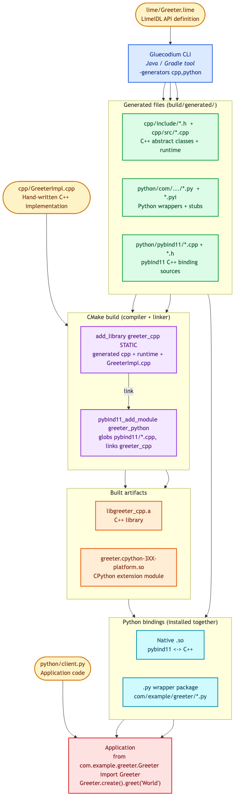
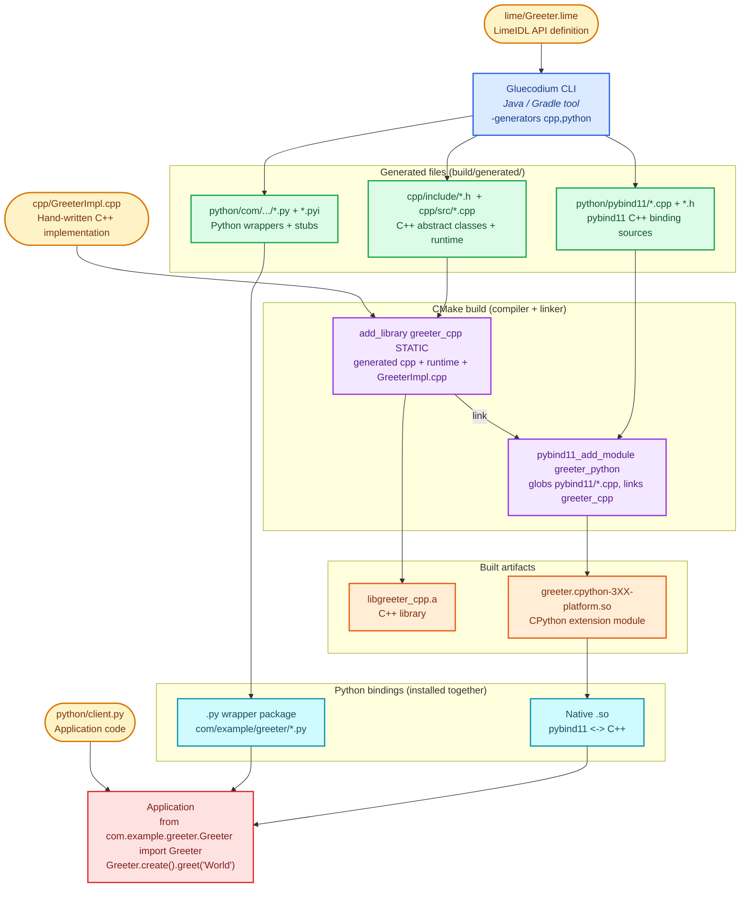
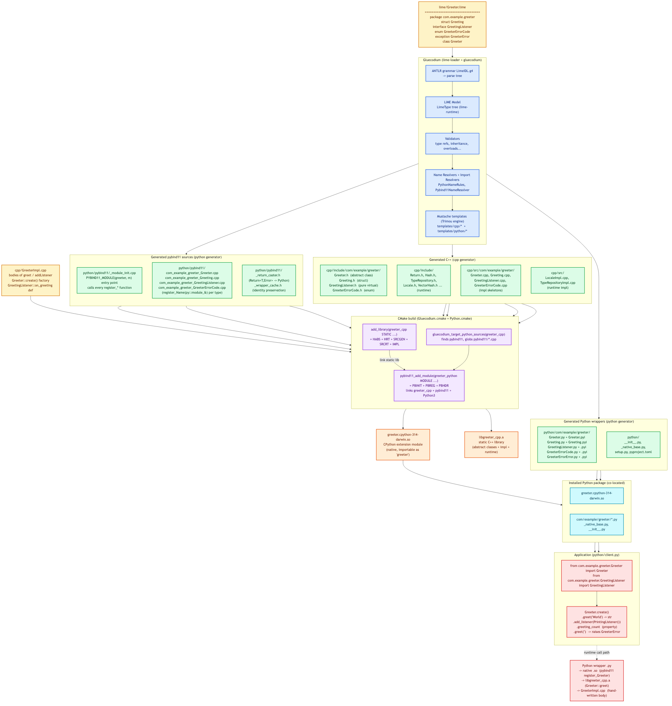
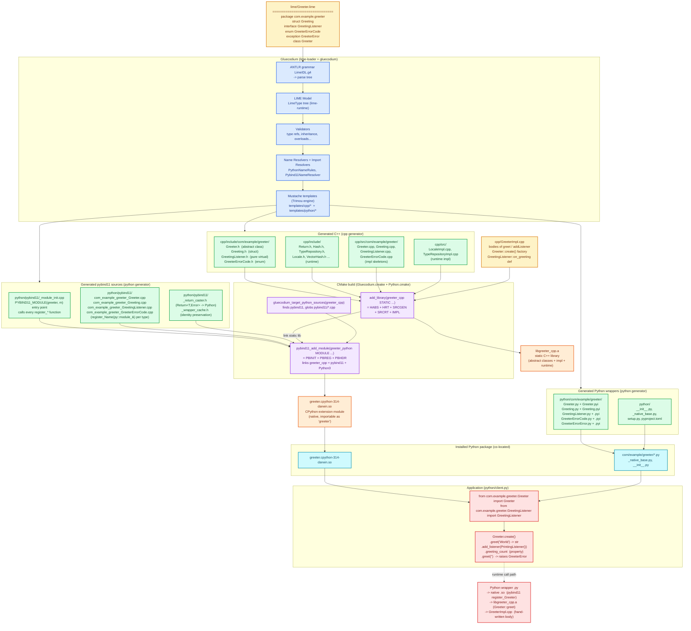

# Gluecodium Python Binding Pipeline

This document diagrams the full lifecycle of a Python binding built with Gluecodium:
from a **LimeIDL** source file, through **code generation**, **compilation** into native
libraries, the **Python bindings** those libraries produce, and finally **application**
usage. Every node maps to a concrete file from the
[`sample_project`](sample_project/) (`com.example.greeter`).

---

## 1. High-Level Pipeline



<details><summary>Editable Mermaid source</summary>



</details>

---

## 2. Detailed File-Level Flow

This diagram traces every concrete file through the pipeline, using the
`com.example.greeter` sample.



<details><summary>Editable Mermaid source</summary>



</details>

---

## 3. Stage-by-Stage Summary

| Stage | Input | Tool / Mechanism | Output |
|-------|-------|------------------|--------|
| **1. Authoring** | — | Developer | `*.lime` (API) + `*Impl.cpp` (C++ bodies) + app `.py` |
| **2. Generation** | `*.lime` | Gluecodium CLI (`-generators cpp,python`) | C++ headers/impl + runtime, Python `.py`/`.pyi` wrappers, pybind11 `.cpp`/`.h` binding sources |
| **3. Compilation** | generated C++ + hand-written impl | CMake (`Gluecodium.cmake`, `Python.cmake`) + C++ compiler | `libgreeter_cpp.a` (C++ lib) + `greeter.cpython-*.so` (extension module) |
| **4. Python bindings** | `.so` + `.py` wrappers | Installed co-located in one dir | Importable Python package (`import greeter`; `from com.example.greeter.Greeter import Greeter`) |
| **5. Apps** | Python bindings | Python interpreter | App calls flow: wrapper `.py` -> native `.so` (pybind11) -> C++ lib -> hand-written impl |

### Key Gluecodium internals (Stage 2)

1. **`lime-loader`** — ANTLR grammar (`LimeIDL.g4`) parses `.lime` text into a parse tree.
2. **`lime-runtime`** — converts the parse tree into the **LIME model** (a language-independent
   `LimeType` tree: structs, classes, interfaces, enums, exceptions, lambdas).
3. **Validators** — check type references, inheritance, overloads, properties, etc.
4. **Generators** (`generator/cpp`, `generator/python`) — each collects names/imports via
   **name resolvers** (`PythonNameRules`, `Pybind11NameResolver`) and applies **Mustache
   templates** (via Trimou) to emit files.
5. **Output** — written under `build/generated/` in `cpp/` and `python/` subtrees.

### Key CMake mechanics (Stage 3)

- **`add_library(greeter_cpp STATIC …)`** — compiles the generated C++ impl skeletons +
  runtime + the developer's `GreeterImpl.cpp` into a static library.
- **`gluecodium_target_python_sources(greeter_cpp …)`** (in `Python.cmake`) — globs
  `python/pybind11/*.cpp`, calls `pybind11_add_module(… MODULE …)`, links the C++ library,
  pybind11, and Python headers, and names the `.so` after the `PYBIND11_MODULE` symbol.
- Because pybind11 validates its source list at **configure** time, generation must run
  first (at configure time via `execute_process`, or at build time followed by a CMake
  re-configure so the glob picks up the generated sources — see the two-pass build in
  `build-python-functional`).

### Runtime call path (Stage 5)

```
Python:  Greeter.create().greet("World")
   |
   v
wrapper:  com/example/greeter/Greeter.py   (thin Python class -> native)
   |
   v
native:   greeter.cpython-314-darwin.so    (pybind11: register_Greeter, trampolines)
   |
   v
C++ lib:  libgreeter_cpp.a                 (Greeter::greet  -- generated abstract decl)
   |
   v
impl:     GreeterImpl.cpp                  (hand-written body -- the actual logic)
```
